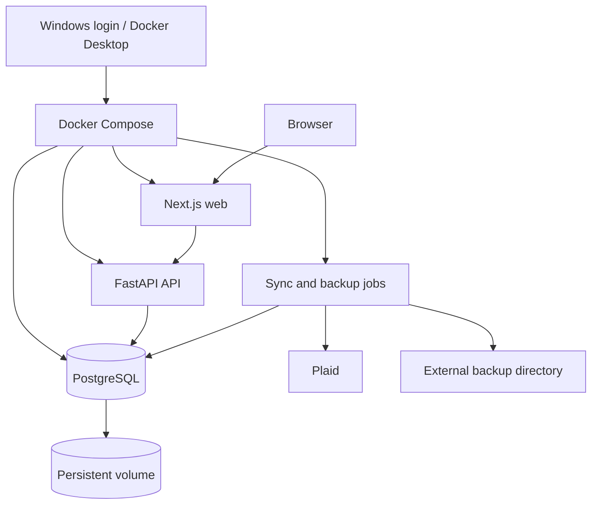

## Revision notes

- Make active-only official classification a mandatory M1 boundary; pending onboarding uses a read-only, in-memory candidate preview.
- Remove mandatory AccountsGet from daily sync; refresh metadata only on explicit onboarding/maintenance or an unknown-account/metadata-resolution requirement.
- Replace standalone `data_version` with `last_published_run_id` and `published_at`, including successful publication within partial runs.
- Use 45-second `/sync/status` polling and refetch relevant analytics while preserving filters; no real-time infrastructure.
- Make M0 a mandatory read-only safety gate, with an isolated restore and explicit human acceptance before M1 or Production restructuring.

**Authority and execution protocol:** This repository-owned document, `docs/PFT_PHASE_1_ARCHITECTURE_PLAN.md`, is the architectural source of truth for Phase 1 operational architecture and implementation sequencing. Implement milestone by milestone. **M0 is a mandatory read-only safety gate. Codex must stop after the M0 report and must not proceed from M0 to M1 without explicit human approval. No Production Compose/runtime/database restructuring may begin before M0 is complete and the user has explicitly reviewed and accepted its report.** Approval of this document is not acceptance of an unperformed M0. This revision authorizes documentation delivery only, not implementation or Production access.

Specialized financial-domain documents remain authoritative for their existing financial rules; this plan governs operational boundaries and sequencing. Where old onboarding instructions allow pending data to alter official results, this plan's active-only boundary takes precedence. Preserve all specialized documents. Do not resolve unrelated discrepancies by silently changing financial semantics.

# PFT Phase 1 Architecture and Implementation Plan

Original repository review baseline (not a claim about the current local checkout): `randytli/personal-finance-tracker`, main at commit `16d91f19ef2589011229fad066276c2935c046fe`.

## Executive recommendation

Phase 1 means a reliable, continuously usable local personal finance application:

1. Start Windows and Docker Desktop.
2. Open the website without starting several development terminals.
3. View existing analytics even when Plaid is unavailable.
4. Fetch new Plaid data automatically.
5. Preserve historical, statement-imported, and manually reviewed data.
6. Show synchronization health and last successful update.
7. Recover the PostgreSQL database from a tested backup.

Use Docker Compose for four services:

- `web`: Next.js production build
- `api`: FastAPI
- `db`: PostgreSQL 16 with the existing persistent volume
- `jobs`: lightweight Python scheduler/sync/backup process

The jobs process and API share the same domain services. Do not introduce Redis, Celery, Kubernetes, or cloud infrastructure in Phase 1.

## Current-state findings

Already implemented:

- Multiple Plaid Items with independent cursors
- Active/pending/disabled Item states
- Raw transaction persistence and normalized transactions
- Incremental `/transactions/sync` pagination
- Consumer account scope
- Manual classification/category/label/benefit overrides
- Internal transfer, refund, reimbursement, card benefit, and membership logic
- Statement imports with provenance, ambiguity blockers, rollback, and Plaid overlap protection
- Analytics dashboards and extensive unit/integration tests
- Production token encryption and database-name safety checks

Missing:

- A unified `sync_all` service
- Automatic scheduling and startup catch-up
- Persisted synchronization runs and health status
- Atomic publication of raw data, normalization, and classification
- Production-style local Compose runtime
- Automated PostgreSQL backup and tested recovery
- Automatic frontend refresh after a successful sync

Important findings:

- Raw ingestion commits separately from normalization and classification.
- Classification currently reads both active and pending Items, even though pending data is excluded from analytics. Pending rows can therefore alter official refunds, transfers, and cross-account matches indirectly. M1 must remove this path before `sync_all` is introduced; changing only analytics filters is insufficient.
- Analytics reads raw removal state, so raw soft deletion must be committed with normalization and global classification.
- Account metadata fetching and transaction persistence already have separate responsibilities. Preserve stored consumer scope for existing accounts and the repository's type-based initial scope for newly validated accounts; AccountsGet need not precede every normal sync.
- Existing sync/normalize/classify functions own separate transactions and must be extracted into caller-session services. Synchronous Plaid SDK work must not block the API event loop.
- Existing advisory locks do not cover every write path.
- The current Compose file mainly starts PostgreSQL; web and API services remain commented development examples.
- `docs/README_PFT.md` describes an outdated Vercel/Supabase, Next.js 14, cleaned-table architecture.

## Proposed runtime

Use database health checks and `depends_on: condition: service_healthy`. The web container must proxy to the API service name, not container-local `127.0.0.1`.

Only after M0 acceptance, explicitly reuse the verified Production volume (for example, an external volume that fails if missing). Prevent Compose from silently creating an empty replacement database or two PostgreSQL containers from mounting the same data directory. M0 must not adopt that volume into a new Compose project.

Use Next.js `build` + `start` and FastAPI without `--reload`. Publish only `127.0.0.1:3000` for normal use; API and database stay internal unless loopback debugging is explicitly needed. Verify proxy configuration at build and runtime. Backend secrets must not enter frontend images or `NEXT_PUBLIC_*`. Use restart policies, health checks, bounded logs, and database reconnect behavior. Daily startup must not install dependencies or rebuild images.

Prefer Docker Desktop login startup with container restart policies; add a Windows login task only if subsequent local testing demonstrates a need. Schema migration is an explicit one-time command; normal API/jobs startup verifies the schema instead of silently migrating it. Keep basic Host/Origin validation and write-request protection despite local-only access.

## Automatic synchronization

The operation should be a shared domain service, callable by jobs and an explicit manual trigger.

### Official classification and pending onboarding — mandatory M1 decision

**Official/published classification must be derived only from active Items.** The shared official query includes only active Items, consumer-enabled accounts, and non-removed transactions, including eligible statement-source rows. Apply this scope before any refund, transfer, reimbursement, or cross-account matching, not merely when returning analytics. All official classification entry points use this query; do not expose an `include_pending` switch on the official writer.

Pending Items may be explicitly synced and normalized for onboarding, outside daily/manual active sync. Their raw/normalized writes remain restricted to the selected pending Item and do not run the official classification writer. When classification preview is needed, load an explicitly selected pending Item plus eligible active rows into immutable candidate records, run the shared classification calculation in memory, and return candidate outcomes marked as unpublished. The preview has no database-writing session and never persists classification, labels, match links, or changes to active rows. No preview tables or dataset versions are needed in Phase 1.

Activation is an explicit reviewed operation: under the derivation lock, revalidate the Item and account scope, change status to active, and recompute official classification for the entire resulting active scope in one transaction. Failure rolls back activation and derivation together. Do not promote stored preview outputs. Existing contamination from pending matching is corrected by active-only recomputation during the approved implementation/cutover, with expected differences documented; it is never corrected during M0.

### Account metadata strategy

Choose **on-demand refresh**, with no additional periodic metadata scheduler in Phase 1:

- Ordinary daily sync uses stored Item-level cursor and stored account ownership/scope. Do not call AccountsGet simply because sync is due.
- Explicit onboarding or an explicit account-maintenance action may refresh metadata. Metadata/balance freshness is not a promise of daily transaction sync.
- If a fully fetched transaction batch references an unknown account or metadata that cannot safely be resolved from stored records, fetch AccountsGet once, outside the write transaction, validate it, discard the transaction buffer, and refetch the complete stream from the original cursor. Bound this repair cycle to one per Item per run, in addition to bounded pagination-mutation retries.
- Preserve existing consumer-scope decisions. Newly validated accounts use the repository's `initial_consumer_scope(type)` rule; unsupported/unknown types remain excluded. Ownership conflicts are blockers, not opportunities to reassign an account. Type drift is reported and never silently changes existing scope.
- A required metadata refresh failure blocks only that Item, leaving its raw rows, normalized rows, metadata, and cursor unchanged. Other Items can publish. A separate optional maintenance refresh failure produces a metadata warning and does not invalidate an otherwise healthy transaction sync.
- Unresolved unknown accounts must not be skipped to advance the cursor. Known disabled accounts continue to be filtered using the existing Item-level stream and scope rules. Preserve existing removed-ID/ownership validation; do not invent missing account attribution.
- Do not infer closure or disablement merely because an account is absent from a metadata response. Metadata changes affecting eligibility follow the same reviewed, locked atomic reclassification protocol as other scope changes.

### Run lifecycle

1. Verify database identity, schema, configuration, and enabled scope. Acquire a database-backed user sync lock using a dedicated connection. Loss of that connection invalidates the run; abort publication and reacquire ownership before retrying. Never steal a lock based only on an old heartbeat.
2. Read due active Items, excluding disabled and paused Items; record a persistent run and its selected scope. An Item with existing transactions but no cursor is blocked unless an explicitly reviewed first-sync onboarding state explains it. Capture each Item's starting cursor and relevant account/scope snapshot.
3. Sequentially fetch every `/transactions/sync` page per selected Item, outside the database write transaction. Use the metadata repair rule above only when needed. On pagination mutation, discard incomplete buffers and restart from the original cursor. Use real SDK timeouts, bounded retries, and a bounded overall run duration. Continue to other Items after an isolated network failure.
4. In one publication transaction, acquire the user derivation lock and lock relevant Items and Accounts in stable ID order. Recheck ownership, active status, original cursor, and account scope against the fetched snapshot. Reject stale buffers if concurrent scope/identity changes invalidate them; refetch next run rather than guessing.
5. For each successfully fetched and revalidated Item, open a savepoint. Validate and persist any required metadata, raw added/modified/removed rows, cursor, and Item normalization inside that savepoint. Preserve statement evidence and manual overrides. A known Item-local validation/overlap failure rolls back the entire savepoint. Do not catch arbitrary programming/database errors as harmless Item failures.
6. If at least one Item is accepted, classify **all eligible active stored transactions once**, after all Item savepoints, within the same outer transaction. Include previously saved data from failed active Items and eligible statement rows. Global classification is not limited to Items synced this round.
7. Commit accepted metadata, raw changes, cursors, normalization, official classification, committed counts, successful Item timestamps, run outcome, and the publication marker together. Finalize failure-only diagnostics separately if the publication transaction rolled back; never advance success timestamps or the marker on that path.

Shared service functions receive the caller's session and never commit internally. Jobs call these functions directly, not a chain of HTTP routes. Apply the lock order `derivation lock → Item → Account → Transaction` to review changes, account/scope updates, activation/deactivation, statement apply/rollback, and other official writers. Read manual decisions only after acquiring the lock. Restrict old split raw/normalize/classify routes to explicit maintenance; ordinary GET requests must not bypass atomic publication to write raw data.

### Failure behavior and publication semantics

| Condition | Required behavior |
| --- | --- |
| One Item network/required-metadata failure | Preserve its stored financial state and cursor; accepted Items can publish; run is partial. |
| Known Item-local validation, normalization input error, ownership conflict, statement overlap, or stale cursor | Roll back that Item's savepoint; no cursor advancement. Unresolved conflicts need user action; stale buffers can be retried safely. |
| Unexpected normalization/database error or global classification failure | Roll back the whole outer transaction, including all accepted Items and cursors; no publication marker update. |
| All selected Items fail or are waiting | Record outcomes without publication or global reclassification. |
| No eligible/due Items | Do not create a false successful publication; report idle. |
| Complete ready response with zero changes | Successful check; commit cursor/check time and publication identity. A harmless frontend refetch is acceptable. |
| Plaid explicitly not ready | Record waiting and schedule bounded retry; Phase 1 conservatively defers that Item's buffer/cursor until ready. Do not claim historical completion. |
| Crash before commit | Database rollback; interrupted run is reconciled after a new owner obtains the sync lock. |
| Crash after commit but before acknowledgement | Committed run/Item state and marker are authoritative; do not overwrite success as failure. |

A failed Item's raw rows, normalization input, cursor, and overrides stay unchanged, but global classification may legitimately reinterpret its existing active transactions using another Item's newly published counterpart. This does not mean the failed bank was refreshed. Display per-Item freshness. A savepoint success is provisional until the outer transaction commits; distinguish received counts from committed counts.

## Scheduling decision

Recommended schedule:

- On jobs startup: sync any active Item whose last successful sync is stale.
- During operation: check scheduler state every minute.
- Normal Item cadence: approximately once per 24 hours.
- Retry temporary errors with bounded backoff, for example 15 minutes, 1 hour, then 6 hours.
- Pause errors requiring user action, such as reauthorization or unresolved data conflicts.
- Permit one deduplicated manual sync request from the UI, for explicitly selected active scope (all active Items by default). It may bypass the normal due time but never authorization, account scope, paused blockers, locks, or validation.
- Persist requested and handled sequence numbers. A run captures the request sequence it handles; completion acknowledges only that captured number. Requests arriving mid-run remain pending for a subsequent run. Repeated clicks coalesce; they never create parallel execution.
- On startup/resume, catch up once for stale Items rather than replaying every missed day. Waiting/not-ready responses receive bounded retries rather than a call every minute.
- `/transactions/sync` fetches changes known to Plaid; Phase 1 does not default to `/transactions/refresh` or promise an immediate bank refresh.

Do not put the scheduler inside FastAPI. Do not add Plaid webhooks in Phase 1. Webhooks require a reachable endpoint and do not help while the local computer is offline.

## Observability model

Add:

### `sync_runs`

- run ID
- trigger source
- started/finished timestamps
- status: running, success, partial, failed, blocked, waiting, interrupted (with explicit per-Item outcomes)
- duration
- published_at, nullable until a successful publication
- classification status
- sanitized error summary

### `sync_item_runs`

- run ID and Item ID
- attempt/start/end timestamps
- status and phase
- pages fetched
- added/modified/removed counts
- skipped-disabled counts
- normalized/classified counts
- retry count
- sanitized error category/request ID

### Runtime state

- jobs heartbeat
- last attempted/successful sync per Item
- next retry time
- requested and handled manual request sequences
- last successful backup
- `last_published_run_id` and `published_at` for the most recent committed sync publication

The frontend should display:

- last successful update
- current run status
- institution-level success/failure
- counts
- last error requiring action
- last successful backup
- jobs heartbeat/stopped state

Use UTC timezone-aware timestamps. Separate last attempt, last successful check (including no-op), last actual data change, and last publication. Do not use `Item.updated_at` or latest transaction date as bank freshness. Full health requires checking all relevant active Items; a run over only some Items cannot declare every bank fresh. Metadata warnings are separate from transaction success.

### Publication identity and deliberately simple frontend refresh

`last_published_run_id` identifies the last sync run that committed at least one Item plus global classification; `published_at` records that commit's publication time. A partial run can advance this marker. A failed, blocked, waiting-only, or interrupted-before-commit run cannot. The name deliberately avoids implying that every Item succeeded. There is no separate `data_version` field, version table, retained snapshot, or historical dataset-selection API.

While the application is open, poll `GET /sync/status` every **45 seconds**, and check immediately on opening or regaining focus. Polling is read-only. When the marker changes, refetch the currently relevant Overview, Membership, Review, and open detail queries. Preserve month/range, institution/account, category, pagination, and view filters. Prevent stale in-flight responses from replacing a newer refresh. Refetch on focus even when the marker is unchanged so manual changes from another session eventually appear.

Each analytics response must use a consistent database read snapshot for its own queries. A lightweight status check before/after a refresh batch detects a sync publication crossing the requests: if the marker changes, discard/retry the affected batch. This is eventual UI convergence, not an immutable cross-request dataset snapshot. Same-session review edits, activation, account-scope changes, and statement actions invalidate relevant queries directly on success; they do not invent a successful sync run ID. No WebSockets, SSE, message queues, or pub/sub.

True dataset versioning is deferred until a concrete requirement exists for historical snapshots, reproducible cross-request exports, or strict cross-client consistency for every non-sync mutation. Run identity is a refresh signal; atomic transactions and lock discipline provide data safety.

Never store access tokens, raw cursors, transaction payloads, connection strings, or secrets in logs or status responses. Allow only safe error categories/codes, phase, request ID, and sanitized short explanations.

## Historical data and the Plaid window

The 730-day value applies to the initial Transactions history request. It is not a rolling rule that should delete old PostgreSQL rows. A continuously connected Item can accumulate older history over time.

Rules:

- Never delete transactions merely because they are older than 730 days.
- Apply only explicit incremental updates returned after the stored cursor.
- Treat `removed` as a soft withdrawal from analytics.
- Preserve raw payloads, normalized history, overrides, and source provenance.
- Never allow Plaid updates to modify statement-source rows.
- Re-linking an institution or creating a fresh Item is a separate migration and must never be assumed to preserve Plaid IDs.

Pending-to-posted transitions may produce a removed pending ID and a new added posted ID, possibly on different pages. The implementation must process both.

## Backup and recovery

Minimum safe plan:

- Run PostgreSQL 16 `pg_dump` in custom format once per day, preferably before sync; sync failures must not prevent backups.
- Create extra backups before schema changes, Production onboarding, and data cutovers.
- Write to a temporary file and validate before replacing the latest backup.
- Retain 7 daily, 4 weekly, and 3 monthly backups; prune only after a new backup succeeds. Custom-format dumps are not themselves encrypted.
- Store daily copies in a protected Windows host directory outside the PostgreSQL volume and Docker/WSL virtual disk; retain an encrypted external-media copy weekly. Jobs uses a PostgreSQL client and never mounts the Docker socket.
- Protect the backup directory with disk encryption and local permissions.
- Store `PLAID_TOKEN_ENCRYPTION_KEY` separately in a password manager and recovery medium.
- Record backup time, schema version, application commit, size, and checksum.
- Restore into a new isolated database with jobs and Plaid calls disabled.
- Verify Items, accounts, raw/normalized rows, statement provenance, overrides, cursors, token decryption, and analytics before considering recovery successful.

A dump does not include all cluster roles; the recovery runbook must cover required role creation. Never test `restore --clean` on the source database. Compare backup-consistent source counts, date ranges, removal states, override/provenance fingerprints, and monthly totals to the isolated restore. Test decryption without exposing plaintext. Daily recovery can lose up to about a day's local changes while regularly running; whole-machine loss depends on the external-copy interval. Plaid cannot recover lost manual decisions.

## Phase 1 Definition of Done

### Implementation protocol

- M0 report records every required fact and a successful isolated restore; missing evidence means the gate is incomplete.
- Explicit human acceptance of the completed M0 report is recorded before M1 or any Production restructuring. Codex stops after reporting M0; silence, passing tests, and approval of this architecture are not acceptance.
- Milestones proceed in order with evidence and remaining blockers recorded. Production writes/Plaid calls still require the explicitly authorized scope; M0 acceptance is not blanket permission for unrelated Production actions.

### Product and analytics

- Existing Overview, Review, Membership, reimbursement, benefit, and category semantics remain correct.
- Automatic sync eventually refreshes analytics without manually calling multiple endpoints.
- Pending/disabled Items and consumer-disabled accounts cannot participate in official classification or affect active matches. Pending preview produces no official writes; activation and active-only reclassification are atomic.
- Sync state and partial failures are visible.

### Runtime

- Windows login and Docker startup make the application available locally.
- PostgreSQL data persists through restarts.
- Web/API/database health checks work.
- Restart, shutdown, Docker restart, and sleep/resume are tested.

### Data safety

- For accepted Items, metadata, raw data, cursors, normalization, classification, success state, and publication identity commit atomically; rolled-back savepoints contribute no committed counts.
- Historical rows, statement imports, and manual overrides are preserved.
- Conflicts cannot advance a cursor.
- No implicit relink, cursor reset, age-based cleanup, or destructive duplicate deletion occurs.

### Synchronization

- Startup catch-up and daily scheduling work.
- Only one sync run executes at a time.
- Item-level failure isolation works, including required metadata failures; known-account daily sync succeeds without AccountsGet. Failed-bank stored active rows still participate in global matching.
- Pagination mutation retry starts from the original cursor.
- Crash and retry behavior is tested.

### Observability and recovery

- Every Item has last attempt, last success, and actionable error state.
- Jobs and backup failures are visible.
- Logs do not expose secrets.
- Backup retention works.
- An isolated restore has been performed successfully with jobs/Plaid disabled; required PostgreSQL integration tests actually run, with skips reported and never counted as passing gates.

## Implementation milestones

### M0: Local facts and baseline — mandatory read-only safety gate

Purpose: establish the exact existing Production environment and prove recoverability before implementation.

Read-only Production work includes inspecting configuration/identity, read-only database queries, and creating a consistent backup. Only isolated backup files and restore/test targets may be created. Do not replace, rename, migrate, recreate, restart/reconfigure, or implicitly adopt the existing Production database/volume into a new Compose project. Do not run ingestion, classify, review writes, onboarding/activation, or Production Plaid calls. Do not start an application against Production if startup can call `init_db()` or migrations.

The report must cover every item in the local verification checklist, its evidence, backup identity/checksum, isolated restore results, unresolved blockers, and proposed next milestone scope. Confirm restored analytics can run with jobs and all Plaid calls disabled, without pointing any test writer at the source. Use the baseline-compatible code for this check; no M1 implementation is needed. Test-only bootstrap changes, if unavoidable, belong only in the disposable restore target and must be disclosed.

**Acceptance and stop rule:** M0 is complete only after identity/scope evidence and restore verification pass. Produce the report, then stop and wait for the user's explicit review/acceptance of that report. No M1 work or Production Compose/runtime/database restructuring may begin before that acceptance. If any required fact or restore check cannot be verified, report the blocker and leave the gate closed. This documentation revision does not perform M0.

### M1: Shared sync services, transaction boundaries, and active/pending isolation

Prerequisite: completed M0 report explicitly accepted by the user.

Likely areas: `api/routes/plaid.py`, `api/statement_semantics.py`, `api/routes/review.py`, statement persistence coordination, new `api/services/`, and necessary models/migrations.

Extract caller-session persistence/normalization/classification services without internal commits. Separate immutable classification calculation from official persistence. Make the official active-only scope mandatory in every writer. Implement the in-memory pending preview and atomic activation contract described above. Unify derivation-lock ordering and ensure current manual decisions are read under the lock. Preserve statement provenance and existing financial rules.

Acceptance: existing regression tests pass; service/session ownership and concurrent manual edits are covered. Synthetic tests show that a matching pending refund/payment/transfer cannot modify any active classification, label, or match link; preview performs no writes; activation incorporates the Item only on successful commit and rolls back completely on classification failure. Disabled consumer accounts remain excluded. Document expected correction of previously pending-influenced results separately from unintended financial-rule changes. This boundary must pass before M2 `sync_all` work.

### M2: One-shot safe `sync_all`

Likely areas: sync service, CLI entry point, sync models/migrations, tests.

Acceptance: multi-page sync, stale cursors, repeated batches, removals, statement conflicts, Item savepoints, global classification failure, and crash points are covered with synthetic PostgreSQL data. Also cover no AccountsGet on known-account sync, one bounded unknown-account repair/refetch, failed repair with unchanged cursor/metadata, concurrent scope change rejection, not-ready deferral, partial-publication markers, and post-commit acknowledgement loss. Measure full active classification cost; do not shrink history or change matching rules for premature optimization.

### M3: Full local runtime and backups

Likely areas: Dockerfiles, Compose, `next.config.js`, migration command, health checks, backup script.

Acceptance: one startup path, explicitly verified existing-volume reuse after M0 acceptance, correct internal API routing, restart recovery, and successful backup/restore. Validate on isolated resources first; Production cutover remains scoped and controlled in M6. Test delayed database readiness, wrong-database rejection, interrupted backups, and credential boundaries.

### M4: Scheduler and manual trigger

Likely areas: jobs entry point, runtime state, status API, manual sync endpoint.

Acceptance: stale startup sync, daily sync, backoff, sleep/resume catch-up, deduplication, mid-run request arrivals, two competing jobs processes, lost lock connections, and jobs restart recovery using a controllable clock.

### M5: Sync status and frontend refresh

Likely areas: status endpoints and Overview/Membership/Review pages.

Acceptance: 45-second polling and focus checks refresh relevant analytics on `last_published_run_id` changes, including partial and no-op publication. Failed/waiting-only runs leave the marker unchanged. Test crossing-publication responses, stale response rejection, immediate invalidation after manual edits, preserved filters, stopped jobs, and metadata warnings. Users see institution-level timestamps, errors, and backup health. No real-time infrastructure or dataset-version system.

### M6: Production acceptance and documentation

Acceptance: full required test suite including opt-in database integration tests without skipped gates, frontend build/typecheck, restart/sleep/offline testing, backup restore, and a documented rollback procedure. Record explicitly authorized Production scope and preservation fingerprints; prevent old/new runtimes from writing simultaneously. Verify at least two normal daily cycles and one startup catch-up. Preserve `net_spending = gross − refunds − reimbursements − card_benefits` and all related drill-down totals.

## Local verification checklist

M0 must verify the following locally and include evidence in its report. Repository inspection alone cannot establish these facts.

| Required fact | Required evidence / boundary |
| --- | --- |
| Code identity | Branch, commit, uncommitted state; preserve unrelated user work. |
| Docker engine | Desktop vs WSL engine, active context, actual running container identity. |
| Exact Production database | Database name, container, port, Compose project, and exact mounted volume/data directory; distinguish old pilot/backfill databases. |
| Environment loading | Actual env-file paths and startup/loading commands, without secret values or a full interpolated Compose dump. |
| Item and account scope | Expected institutions; active/pending/disabled states; per-Item consumer-enabled/disabled counts and ownership. |
| Data baseline | Raw/normalized counts and date ranges by source/Item, removed states, override counts/fingerprints, and principal monthly totals. |
| Cursor state | Presence/absence and explainable initialization state for each Item; do not expose cursor values. |
| Statement provenance and blockers | Import/source evidence, overlap/ambiguity state, known authorization or account conflicts; no live Plaid checks in M0. |
| Encryption-key recoverability | Key is independently recoverable and decrypts restored tokens without printing plaintext. |
| Backup feasibility | Destination permissions, free space, protected host location, external-copy plan; successful consistent dump and checksum. |
| Isolated restore | Separate database/container/volume as needed; source is untouched; restored counts, provenance, overrides, cursors, and analytics reconcile to the backup snapshot. |
| Restored application | Baseline-compatible app can read restored analytics with jobs disabled and Plaid network access disabled; confirm exact test DB target before startup. |
| Existing runtime facts | Current ports/proxy, login-start settings, and available sleep/resume behavior evidence; disruptive Production restart tests wait until approved later milestones. |
| Classification cost | Existing measurements or measurements on an isolated restored copy only; no Production recomputation during M0. |

A changing live source must be compared using a consistent backup/baseline snapshot or reconciled read-only evidence, not falsely matched to later live totals. No secret values need to be shared. Report unknowns rather than guessing. **After the report, stop for explicit human acceptance; no M1 or Production runtime restructuring while the gate is closed.**

## Deferred work

Do not include in Phase 1:

- cloud hosting or remote access
- Plaid webhooks and public tunnels
- Redis, Celery, queues, Kubernetes
- WebSockets, SSE, pub/sub, and a standalone dataset-version/snapshot system
- multi-user authentication
- investment analytics
- automatic relinking or cursor reset
- fuzzy statement/Plaid deduplication
- automatic pending-to-posted override migration
- ML classification and broad new category rules
- materialized views or premature incremental analytics optimization

## Architecture decision record

- M0 hard gate → proves identity and recoverability before implementation → reject proceeding on an unchecked list or implicit approval → no bypass; a new Production identity invalidates the affected baseline and requires renewed review.
- Active-only official derivation, fixed in M1 → pending candidates cannot alter published active matching → reject shared active+pending official writes → reconsider only with an explicitly designed isolated dataset model.
- Pending classification in immutable in-memory preview → reuse rules without official writes → reject temporarily persisting then undoing preview outcomes → reconsider only if durable collaborative preview becomes a real requirement.
- On-demand AccountsGet → stored metadata supports normal cursor sync and avoids an unrelated daily failure dependency → reject mandatory per-sync fetching and an extra periodic scheduler → reconsider if metadata-only freshness becomes a product requirement.
- `last_published_run_id` plus `published_at` → simple post-commit refresh including partial runs → reject a standalone `data_version` → reconsider for historical snapshots or strict cross-request/cross-client consistency across every mutation.
- 45-second status polling plus focused refetch → meets local freshness needs while preserving filters → reject WebSockets/SSE/pub-sub → reconsider only with a demonstrated latency requirement.

- Compose full stack -> one predictable local runtime -> rejected native dev processes -> reconsider if Docker resource cost is unacceptable.
- Independent jobs process -> scheduler is isolated from API and shares domain code -> rejected FastAPI scheduler and complex workers -> reconsider for multi-user scale.
- Startup catch-up plus daily cadence -> matches a personal computer's availability -> rejected startup-only and weekly-only -> reconsider for intraday freshness.
- No webhooks in Phase 1 -> no public endpoint required -> rejected tunnel/webhook complexity -> reconsider after remote hosting.
- Network fetch outside DB transaction -> avoids holding DB locks during Plaid calls -> rejected long network transactions -> reconsider with durable staging if data volume grows.
- Item savepoints plus one global classification -> isolates institution failures while preserving cross-account matching -> rejected all-or-nothing Item runs and per-Item classification -> reconsider for multi-tenant workloads.
- PostgreSQL as historical source of truth -> preserves Plaid, statement, and manual evidence -> rejected age-based cleanup -> reconsider only with explicit retention policy.
- Daily `pg_dump` plus tested restore -> simple recoverability for a personal application -> rejected volume-only backup -> reconsider if recovery-point objectives become stricter.

## Documentation changes to make later

These are later milestone tasks, not part of this revision. This delivery changes only `docs/PFT_PHASE_1_ARCHITECTURE_PLAN.md`; it does not modify application code or specialized documents.

- Rewrite `docs/README_PFT.md` to match current code.
- Keep this document as the operational architecture source of truth. If `docs/PHASE_1_OPERATIONS.md` is later useful, make it an operational reference that links here rather than a competing architecture plan.
- Add `docs/LOCAL_RUNBOOK.md`.
- Add `docs/BACKUP_RECOVERY.md`.
- Keep analytics, membership, statement-import, multi-institution, and backfill documents, but mark their scope and update conflicting assumptions.

