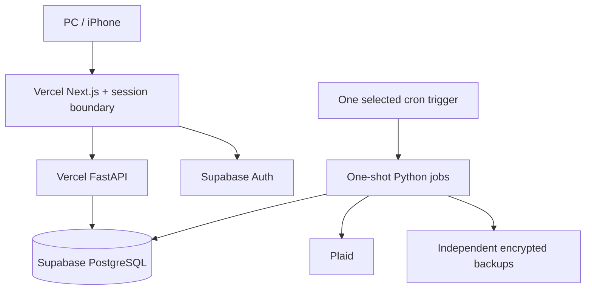

# PFT Phase 2 Architecture and Implementation Plan

**Status:** Proposed for owner review; documentation only.  
**Prepared / revised:** 2026-09-24; revised against the latest owner brainstorm.  
**Repository inspected:** `randytli/personal-finance-tracker`, `main` at [`74681826f33fda110c0de496031db7eec99f7d72`](https://github.com/randytli/personal-finance-tracker/tree/74681826f33fda110c0de496031db7eec99f7d72).  
**Intended repository path:** `docs/PFT_PHASE_2_ARCHITECTURE_PLAN.md`.

This plan governs Phase 2 sequencing and the explicitly identified changes below. Current code is the implementation baseline. Specialized financial documents retain authority except where this plan explicitly proposes a reviewed extension. Phase 1 operational guarantees continue to apply.

This document does not authorize implementation, Production writes, networking changes, resource creation, deployment, live Plaid calls, or secret movement. After review, execute one authorized milestone at a time. Prepare code, isolated tests, and a concrete cutover/rollback packet before requesting approval for the associated Production action. Reuse authorization already given for that exact action and scope; do not repeatedly ask for it.

**Binding decision:** recurring infrastructure cost must remain **$0/month**. Phase 2 Core is M0–M4 on Windows Production + Tailscale. M5 evaluates an optional Vercel + Supabase serverless expansion; it is not a migration authorization. Trials, promotional credits, paid tiers, paid static egress, and paid backup prerequisites do not qualify. If free infrastructure cannot preserve correctness, security, durability, and recovery, retain Windows Production + Tailscale. No automatic fallback host.

**Revision scope:** the current-state audit, Phase 1 invariants, and detailed M0–M4 implementation work are retained. Architecture/cost decisions, M5–M9, completion criteria, sequencing, and affected cross-references are revised. The M3 benefit mapping is a proposal requiring owner approval **before implementation**. No implementation or feasibility experiment was performed for this document revision.

## 1. Current-state findings

Repository files were inspected at the pinned commit. The Windows PC, its current uncommitted checkout, Production database, and live service health were not accessed. Historical counts and passing tests below are committed acceptance evidence, not fresh live measurements or tests performed for this plan.

| Area | Verified repository behavior | Phase 2 implication |
| --- | --- | --- |
| Runtime | `compose.runtime.yml` runs web, API, jobs, and PostgreSQL. Only web publishes a port: `127.0.0.1:3000`. `docker-compose.production.yml` reuses the explicit Production volume and checks for existing PostgreSQL 16 data. | Preserve the working runtime through the product milestones. Phone access initially reaches this same instance. |
| Versions | `package.json` specifies Next.js `^15.5.24`, React `^19.2.8`, and Recharts `^2.8.0`. Docker uses Node 22, Python 3.12 for API, and PostgreSQL 16 tooling for jobs. | Do not implement against the older Next.js 14 architecture described in `docs/README_PFT.md`. Resolve installed versions from the lockfile at implementation time. |
| Proxy | `next.config.js` rewrites `/api/pft/{plaid,review,analytics,sync}/…` to `PFT_API_URL`. `Dockerfile.web` sets `http://api:8000` during the build. | Cloud frontend builds require the correct server-side upstream at build time; a runtime variable alone must not be assumed sufficient. |
| HTTP boundary | `api/main.py:local_request_boundary` allows three API Host names and one exact write Origin when `PFT_STRICT_LOCAL_HTTP=true`. | Private phone writes need explicit origin configuration. A Host/Origin check is not user authentication. |
| Authentication | Financial routes use a configured `PLAID_PILOT_USER_ID`; there is no authenticated request principal. Supabase and `jose` dependencies alone do not provide authentication. | Protect every financial route in FastAPI before public deployment. Preserve existing data ownership IDs when introducing Auth. |
| Startup | API lifespan calls `plaid.validate_runtime_configuration()`, database-name verification, and read-only schema verification. Plaid validation requires credentials, including the Production token key. | A cloud reader cannot currently start without unnecessary Plaid secrets. Split configuration by service capability. |
| Schema | Explicit `api.migrate_once` calls additive/idempotent helpers in `api/migrations.py`. Runtime checks required model columns; there is no general Alembic/schema-version ledger. | Record schema fingerprints and migration evidence; do not invent a current schema version or auto-migrate at startup. |
| Synchronization | `api/services/sync_all.py` fetches outside the publication transaction; accepted Item savepoints, normalization, full active-scope classification, cursors, and publication state commit together. | Rehost these services; do not replace them with independent cloud HTTP steps. |
| Locks | Jobs and sync use dedicated connections with session advisory locks and backend-PID checks. Consumer derivation uses a transaction advisory lock and ordered row locks. | The existing session-lock path needs direct PostgreSQL or session pooling. M5 must test per-invocation connection ownership; transaction pooling is unsafe for these session locks. Preserve transaction publication locks under any approved adaptation. |
| Review bulk edits | `POST /review/transactions/bulk-edit` already validates 1–100 distinct IDs and applies one operation atomically. It supports expense/reimbursement classification, category setting, and label include/exclude/restore. | Extend this endpoint and shared UI, including benefit categories and restore operations. |
| Review UI | Credits & Transfers passes `categoryOptions={[]}` and does not enable bulk categories. Its single-row category editor appears only for reimbursements. Review responses lack the benefit-category fields already provided by analytics details. | Complete the shared eligibility/response model and expose appropriate controls in Review. |
| Toolbar | `BulkTransactionEditor` already has `sticky bottom-3`. Each page places it inside a short wrapper after the rows; Overview and Membership additionally use `overflow-hidden` containers. | Fix containing-block/scroll structure and verify actual geometry. Adding `sticky` again is insufficient. |
| Benefit overrides | A distinct `manual_benefit_category_overrides` table and single-row PUT/DELETE already exist. `mutate_benefit_category` validates effective type but calculates its automatic result without passing that effective type. | Share a correct benefit mutation helper; cover manually classified benefits explicitly. |
| Category analytics | Monthly total subtracts refunds, reimbursements, and benefits. Existing `category_breakdown` and `summarize_category_transactions` subtract only refunds and reimbursements. Benefits have a separate breakdown. | Add canonical category Net Spending without silently changing existing API field meaning. |
| Reimbursements | Effective category is manual category or `UNCATEGORIZED`. No persisted expense-allocation/link model exists. Membership reimbursements remain unallocated to expense accounts. | Do not invent expense linkage or transfer the credit to another account/month. |
| Legacy maintenance routes | `/plaid/transactions`, `/accounts`, `/transactions/normalize`, and `/transactions/classify` remain callable separately; some accept active Items. | Before cloud exposure, close public paths that could bypass normal atomic publication. |
| Backup | `api/backup.py:connection()` requires the local `db` service except in a narrowly guarded test mode; jobs calls it at startup. `backup_crypto.py` provides interactive encrypted dump+manifest bundles. | Remote DB backup compatibility is a prerequisite to the DB cutover. Unattended encryption/upload is additional work. |
| Scheduling | Jobs polls every 60 seconds; due Items use a roughly 24-hour interval plus persisted retries. It automatically invokes only the daily backup kind. | Retention settings for weekly/monthly backups do not imply those backups are currently scheduled. |
| UI freshness | `components/sync-health.tsx` polls every 45 seconds, watches publication IDs, refreshes on focus, and brackets response batches with marker reads. | Preserve this behavior; sync publication IDs do not represent manual-edit versions. |

### Recorded Phase 1 evidence and remaining gate

`docs/PFT_M6_INITIAL_SYNC_2026-09-23.md` and `docs/PFT_M6_RECOVERY_ACCEPTANCE_2026-09-23.md` report five active Items, 13 accounts, 2,610 raw and normalized rows, one published run, September net spending of `4421.50`, successful isolated restore, and successful repeated Windows sign-in recovery. The account scope was nine consumer-enabled accounts and four disabled investment accounts. Earlier preservation evidence records one statement batch, 171 statement rows, and 60 classification / 166 category / 27 label / 8 benefit override rows, preserved across initial sync.

The committed M6 report **still leaves two subsequent naturally elapsed daily cycles open**. The initial startup catch-up was exercised, but a later overdue catch-up after downtime was not demonstrated by the short restart tests. M0 must obtain the current evidence; do not certify elapsed observations from calendar assumptions. The last recorded preflight baseline was **235 backend tests with zero skips, 28 frontend tests, typecheck, and production builds passing**. Re-run the appropriate baseline on the actual implementation checkout.

### Additional serverless constraints found in the same checkout

| Repository fact | Consequence for M5 |
| --- | --- |
| `api/services/sync_all.py` sets `MAX_RUN_SECONDS = 300`; Plaid requests use bounded network timeouts, fetch all accepted Item results into memory, then publish through the existing transaction/savepoints. | This budget already equals the currently documented Vercel Hobby function maximum. Cold start, lock acquisition, classification, commit, and response need headroom. Do not declare compatibility from the configured timeout or one fast historical run. |
| `api/jobs.py:tick` already represents one scheduler iteration with injectable clock/services and a jobs session lock scoped to that tick; `run_forever` owns configuration validation, the loop and 60-second sleep. | Reuse/extract a thin `run_scheduler_once` around this durable-state logic. Avoid a second scheduler/domain implementation. |
| Jobs/sync locks use dedicated connections, `pg_try_advisory_lock`, backend PID checks and commits; financial derivation uses transaction-scoped and ordered row locks. | Session ownership must survive the complete invocation. A transaction pool cannot preserve it merely by disabling prepared statements. Durable claims need fencing if introduced. |
| `api/db.py` constructs a global SQLAlchemy async engine/session factory from environment settings; API lifespan disposes the engine. | Test warm/cold invocation lifecycle, event-loop compatibility, concurrent requests, connection cleanup and bounded total pools. Never share an AsyncSession between invocations. |
| `api/backup.py` invokes `pg_dump`, `pg_restore` and `createdb`, has a local-host connection guard and a 1,800-second process timeout; existing storage is a mounted private directory. `backup_crypto.py` prompts interactively. | Serverless packaging, compatible binaries, ephemeral space, bounded execution, unattended encryption and independent upload are unproven. Restore tooling may run on an isolated recovery machine; scheduled backups cannot depend on the old PC. |
| Status treats a heartbeat older than seven minutes as stale; backup status uses a 25-hour overdue threshold. | A healthy idle one-shot scheduler must not appear dead. Preserve financial freshness and backup warnings while separating trigger/execution liveness. |

The committed initial-sync report describes a roughly six-second run. That historical observation is useful context, **not** a measured tail-latency, cold-start, catch-up, or backup feasibility result. M5 is currently **not executed**; no `SERVERLESS_GO` is asserted here.

## 2. Architecture decision hierarchy and hard cost constraint

| Path | Architecture | Decision |
| --- | --- | --- |
| Phase 2 Core, M0–M4 | Existing Windows Production Compose + private Tailscale access | Required product path; no new recurring infrastructure subscription; PC must be on |
| Preferred optional expansion | Vercel Next.js + Vercel Python/FastAPI + Supabase PostgreSQL/Auth + one scheduled trigger | Hypothesis only; M5 and M7 must prove safe, recoverable $0 operation |
| Failed feasibility or rehearsal | Retain Windows Production + Tailscale | Successful Core outcome; stop cloud expansion |
| Future optional study | OCI Always Free or another stable $0 persistent host | Separate owner-approved architecture decision; no automatic provisioning or assumed capacity |

The $0 constraint covers hosting, compute, database, authentication, scheduler, required networking and independent backups. No free trial, expiring credit, upgrade dependency or paid custom domain is part of the design. Existing hardware/electricity and existing Plaid arrangements are outside the new infrastructure subscription decision; do not change them under this plan. Reverify Tailscale Personal eligibility and limits before M1, and cloud permanent-free terms and account eligibility before implementation. No vendor's pricing is guaranteed forever. [E1][E6][E8]

“Vercel + Supabase only” refers to application compute, SQL and Auth: there is no required persistent app server/worker. **Independent backup storage outside Supabase remains required** and may use one additional verified permanent-free storage provider. This is an explicit recovery dependency, not permission to add paid compute.



This diagram describes the optional hypothesis, not a verified deployment. API and job entry points delegate to the existing Python domain services. Separate Vercel projects/functions may be needed for secret/capability isolation; M5 must prove the actual monorepo packaging and project limits. Supabase Cron, if selected, triggers Python over authenticated HTTPS; PostgreSQL does not execute the Python job itself. The browser never accesses financial SQL tables directly.

### Authority and availability by stage

| Stage | Production authority | Scheduler authority | PC-off behavior |
| --- | --- | --- | --- |
| M0–M4 | Existing local PostgreSQL | Existing Windows jobs | Unavailable; expected Core limitation |
| M5–M7 | Existing local PostgreSQL; all cloud work isolated/non-Production | Existing Windows jobs; only synthetic/sandbox rehearsal jobs in cloud | Production still unavailable |
| M8a: DB cutover | Supabase after exact frozen-source acceptance | Windows stopped during freeze; may temporarily resume only against Supabase under the approved transition | DB exists; app access not yet accepted |
| M8b: authenticated reader | Supabase | Only the explicitly retained Windows scheduler, if any | Read latest committed financial state; public app cannot mutate or call Plaid |
| M8c: scheduled jobs | Supabase | One selected cloud schedule; Windows jobs disabled before activation | Accepted scheduled sync and independent backups |
| M8d–M9 | Supabase | Same single cloud schedule | Authenticated reads/writes, sync and recovery independent of old PC |

The reader uses live committed state, not a replica or browser cache. Manual edits can be newer than the most recent Plaid publication marker. Every M8 stage has separate acceptance and an explicit writer/scheduler inventory.

### Required security versus optional network hardening

Require TLS with certificate/hostname validation, strong credentials, owner authentication and authorization, least-privilege SQL roles, verified database/dataset/deployment identity, isolated secrets, no frontend privileged credentials, no browser-direct financial tables, and disabled/restricted unnecessary Data APIs. Never publish the local Windows PostgreSQL port.

A provider-managed, authenticated TLS SQL endpoint is distinct from exposing an unauthenticated local database. Backend access to a publicly routable managed endpoint is the proposed free-network model; test its security directly. IP allowlisting/static egress is optional defense in depth when available without cost. It is not a hidden prerequisite. If this model cannot meet the owner's security boundary without a paid feature, issue `SERVERLESS_NO_GO`; do not weaken required controls or buy an upgrade. [E3][E4][E9]

Oracle Always Free may preserve Compose and a persistent worker, but is not part of this execution path. A later study must reverify account eligibility, regional capacity, idle reclamation, ARM/image compatibility, security, backups and permanent-free quotas before an owner decides whether to proceed.

## 3. Milestone summary

**Phase 2 Core = M0–M4.** Its completion is a successful deliverable even if the optional cloud hypothesis fails. Preserve product work and the existing automatic Windows runtime before investigating cloud expansion.

| Milestone | Deliverable | Change class | Dependency / gate |
| --- | --- | --- | --- |
| M0 | Fresh baseline, preservation/recovery evidence, open Phase 1 checks | Audit | Accepted report before Phase 2 mutation |
| M1 | Private iPhone access with PC on | Network + HTTP boundary | M0; scoped networking/restart approval; free personal plan |
| M2 | Review/bulk/benefit edits and functioning bottom toolbar | Backend contract + UI | M1 for phone acceptance; atomicity and financial invariants |
| M3 | Canonical category Net Spending | Reviewed financial semantic extension | M2; owner approves mapping/attribution **before implementation**, then verifies release evidence |
| M4 | Complete real-phone mobile experience; Core acceptance | UI | M1–M3 and preserved Phase 1 guarantees |
| M5 | Zero-Cost Serverless Feasibility report | Research, benchmarking, isolated prototypes | M4; explicit `SERVERLESS_GO` or `SERVERLESS_NO_GO`; no Production migration |
| M6 | Serverless Architecture Foundation | Code/config/security and additive operational schema where justified | M5 GO; existing Production authority unchanged |
| M7 | Non-Production Vercel + Supabase Rehearsal | Actual free deployments, synthetic/sandbox work, recovery | M6; measured correctness, resources and independent restore; no Production migration |
| M8 | Staged Production Cloud Cutover | DB authority → authenticated reader → scheduled jobs → read/write | M7 pass, fresh frozen baseline, working backup/restore and separate stage acceptance |
| M9 | Zero-Cost Recovery and Final Acceptance | Observed operation + actual recovery | M8; recent restore points, independent recovery, $0 evidence before PC retirement |

Execute **M0 → M1 → M2 → M3 → M4 → M5**. On `SERVERLESS_NO_GO`, stop cloud work and retain the completed Core on Windows + Tailscale. On `SERVERLESS_GO`, continue only with authorized **M6 → M7 → M8 → M9**. M9's recovery implementation belongs in M6 and must be demonstrated in M7; M9 closes acceptance after real operation. Never postpone backup feasibility until after data migration.

## 4. Major architectural decisions

| Decision | Approach | Reason / boundary |
| --- | --- | --- |
| Cost | Hard $0 recurring infrastructure; permanent-free services only | Failed feasibility means retain Core, not upgrade |
| First phone access | Windows Tailscale Serve → Windows `127.0.0.1:3000` | Same app/DB; owner devices only; no device data synchronization |
| Bulk edits | Extend one atomic endpoint/shared editor | Preserve locks, validation, audit fields and page scope |
| Benefit overrides | Explicit Set stores manual decision; Restore clears it | Preserve automatic values and explicit manual precedence |
| Canonical attribution | Pure derived service and proposed benefit mapping | Owner approval before implementation; no redundant column/backfill |
| Refund/reimbursement | Own posted month/account, existing category rules | Unreviewed reimbursements stay Uncategorized; no inferred pairing |
| Category API | Add canonical fields/endpoint; retain legacy meanings | Avoid silent financial/API changes |
| Owner identity | Verified Supabase JWT subject mapped to existing PFT user | No ownership-ID rewrite or multi-tenant expansion |
| Browser session | BFF is a preferred prototype candidate; select after M6 comparison | Reduce browser token exposure; prove refresh/CSRF and free-runtime fit; do not default to sessionStorage |
| Access mode | Server read-only/read-write, route capabilities, SQL roles | Every route protected; hidden buttons are insufficient |
| DB connections | Test direct/session route and bounded per-invocation lifecycle | Preserve existing session locks; avoid connection explosion |
| DB identity | Durable dataset ID + deployment ID + pinned endpoint | Restored UUID or generic DB name alone is insufficient |
| Data API | Disable unnecessary exposure; restrict grants/default privileges | Auth does not require browser financial-table access |
| Scheduler | Thin one-shot adapter reusing `tick`/`sync_all`; one trigger system | Durable due/retry/manual state; no duplicated financial logic |
| Coordination | Retain valid invocation-scoped session locks; add fenced claim only if necessary | No casual lock removal; preserve publication transaction |
| Backups | Encrypted logical export + one independent permanent-free store | Real isolated recovery; no dependency on old PC filesystem |
| Refresh/status | Retain publication/focus refresh; distinguish idle jobs from failed jobs | No WebSockets, event bus or invented global data version |

## 5. Major risks and required controls

| Risk | Required control |
| --- | --- |
| Phase 1 completion assumed | M0 checks outstanding naturally elapsed cycles and recovery evidence |
| Financial rule hidden in UI work | M3 semantic approval before implementation; aggregate/detail reconciliation before release |
| Bulk partial application or stale selection | Locked whole-request validation and atomic rollback |
| Phone boundary weakened | Exact Host/Origin policy and real proxy-chain tests |
| Current 300-second sync budget reaches free function deadline | Measure every stage and worst supported catch-up; budget safe cleanup/commit headroom |
| Cron too infrequent for retries/manual requests | Compare actual free limits; select one adequate cadence; no polling-loop host or quota loophole |
| Ephemeral process loses scheduling state | Persist due/backoff/manual request and execution outcomes; replay-safe ownership |
| Pooled connection loses session lock | Prove selected session/direct behavior, PID/ownership checks and lock-loss abort |
| Lease expiry permits stale publisher | Fencing validated under row lock in the publication transaction; expiry alone is insufficient |
| Free quota/pause interrupts service | Measure account-level usage, growth and pause/recovery; no anti-pause hacks or auto-upgrade |
| Backup depends on PC, incompatible binaries or paid storage | M5 prototype and M7 actual encrypted upload/isolated restore within permanent-free limits |
| Browser token theft / public bypass | Deliberate session design, direct API owner checks, CSP, CSRF for cookies, no secret-bearing frontend |
| Reader needs Plaid secrets or permits mutations | Capability-specific startup, route enumeration, restricted SQL reader and external-call negative tests |
| Preview/restore connects to Production | Distinct credentials, endpoint and deployment identity; no Production secrets in previews |
| Migration loses history/overrides/cursors | Frozen exact dump and fingerprints; full preservation checks; never re-download as migration |
| Two schedulers or stale local DB restart | Explicit handoff inventory, disable old restart/config paths, one authoritative DB |
| Cloud writes make old rollback snapshot stale | Freeze/capture newest state; fix forward or approved reverse migration; never resume stale source |
| $0 plan silently requires paid controls | Gate fails; retain Core; optional paid hardening cannot become mandatory |

## 6. Invariants and shared execution rules

1. Official classification and analytics use active Items, owned consumer-enabled accounts, and non-removed rows. Pending preview remains an in-memory read-only calculation and cannot alter active state. Consumer-disabled investment evidence stays retained and excluded.
2. Manual classification, category, benefit-category, and label decisions remain separate from automatic state. Restore records a clear using the existing audit convention; it does not overwrite raw Plaid fields or discard the latest automatic result. Audit tables currently store creation/latest change, not a full revision history; do not claim otherwise.
3. Confirmed internal transfers remain economically excluded. Existing amount-sign validation, exact Zelle confirmation matching, statement-kind evidence, and manual non-transfer precedence remain intact.
4. Historical rows are durable. Do not rebuild from a fresh 730-day download, delete old rows by age, reset cursors for convenience, or copy overrides onto replacement IDs without a separate reviewed rule.
5. Keep `sync_all` publication atomic. Failed Item source rows/cursor are preserved; accepted Items may publish together. Global classification can legitimately reinterpret a failed Item's existing active rows using new counterparts elsewhere; its bank freshness still does not advance.
6. Preserve lock acquisition order: consumer derivation guard → ordered Items → ordered Accounts → Transactions. Session-lock ownership loss aborts publication. Never infer ownership solely from heartbeat age. A serverless adaptation may replace only scheduler-specific coordination after M5 evidence, retaining transaction locks and proving fenced publication against stale owners.
7. Normal API/jobs startup is verification-only. Migrations run as explicit one-off operations against an independently verified target.
8. A single financial DB is authoritative at any time. Multiple approved API processes may access that same DB with the existing locks; that is distinct from dual-writing local and cloud copies. Only one scheduler is intentionally active.
9. Keep daily sync, backoff, no-op/partial publication semantics, and on-demand metadata repair. Do not add automatic `/transactions/refresh`, webhooks, or daily AccountsGet.
10. Preserve per-response consistent read snapshots. Publication bracketing detects sync crossing a response batch; it does not guarantee a cross-request snapshot across simultaneous manual edits. Current-tab edits invalidate dependent queries immediately; another device refreshes on focus/reload. Stronger cross-device edit consistency is deferred unless required.
11. Production cutovers need a current baseline, concrete expected changes, recovery point, validation, and rollback packet. Before any destructive recovery, capture current authoritative state and review the loss window.
12. Keep development, tests, previews, and restores isolated. No test command may inherit the Production `DATABASE_URL`, pilot ID, or token material. Do not print full interpolated Compose configuration or raw token/cursor values.

13. The hard $0 constraint cannot be traded against financial correctness, security or recovery. No paid prerequisite, expiring-credit dependency, artificial keepalive, split-account quota evasion or duplicated cron workaround.
14. Serverless process memory, local files, an HTTP success code and a cron delivery are not durable completion evidence. Acknowledge completion only after the relevant database commit or verified independent backup; expose failures truthfully.
15. M5–M7 do not move Production authority. A GO report enables the next authorized milestone only; it does not authorize M8 Production actions.

## 7. M0 — Baseline freeze and Phase 2 safety gate

**Objective and placement:** Establish what is actually running and recoverable before changes. “Freeze” means pinning an evidence baseline and code reference; it does not silently authorize stopping Production jobs.

**Dependencies:** None. Read the current repo skill and any current `AGENTS.md`; no `AGENTS.md` was present in the inspected tree.

**Areas:** Existing `scripts/pft_m6_fingerprint.py`, Phase 1 M0/M6 reports, runtime Compose, tests, and a new dated Phase 2 baseline report. No schema/backend/frontend/infrastructure changes in this audit.

### Work

1. Record actual branch, SHA, `git status`, relevant uncommitted changes, and running image identity. Compare with this plan's baseline and update factual deltas before implementation.
2. Verify DB name, PostgreSQL version, role, container/project/volume, the sole running volume owner, env-file provenance, loopback binding, and old-container restart policy. Record identities without secrets.
3. Take a UTC, repeatable-read fingerprint using the existing helper: all app tables and columns, raw/normalized counts and source/date/removal scope, Items/accounts, consumer flags, overrides including cleared rows/audit columns, statement evidence, and ownership integrity. Inspect constraints/indexes as well as the runtime column check. Record schema hash and migration helpers applied rather than an invented version number.
4. Record latest committed publication, per-Item cursors as presence/digests only, run outcomes, heartbeat, pending manual sequences, backup success/attempt/error, and representative monthly/category/institution/account/Membership totals.
5. Reuse the newest suitable verified backup and isolated restore evidence when it covers the baseline; if not, prepare a fresh approved read-only source dump and isolated restore. Never restore over Production. A moving source requires matching snapshot evidence; do not compare unrelated moments and call the difference corruption.
6. Recheck the Phase 1 daily observations. M1–M4 isolated work may proceed with these explicitly open after M0 acceptance. M8 authority migration and retirement of the local host require Phase 1's remaining normal-cycle evidence to be closed, or a separately reviewed replacement acceptance protocol.
7. Establish current tests on a fresh synthetic DB, including opt-ins. Record skips honestly. Do not update live classifications merely to produce a cleaner baseline.

**Acceptance:** Identity and scope are unambiguous; preserved-data fingerprints and financial equations are recorded; recovery is demonstrated; test status and open M6 checks are explicit. Unexpected differences from the old report are explained as intervening operation, user edits, or a blocker.

**Security / migration:** Read-only source inspection, private evidence artifacts, isolated restoration only. A consistent write-frozen cutover snapshot is deferred to M8.

**Rollback:** No Production mutation to undo. Remove only newly created disposable test resources if desired; preserve reports and recovery artifacts.

**Stop/go:** Stop for owner acceptance of the concrete M0 report. Wrong DB, uncertain volume ownership, unexplained integrity errors, missing key recoverability, or a failed restore is a no-go.

## 8. M1 — Private mobile access while the PC is running

**Objective and placement:** Let the owner use the current app on iPhone over Wi-Fi and cellular with the PC running. This provides a real-device feedback loop before broad responsive work.

**Dependencies:** Accepted M0. Networking installation/configuration and Production restart need their specific approval.

| Surface | Planned change |
| --- | --- |
| Backend | Evolve `api/main.py:local_request_boundary` into explicit Host and Origin validation; focused runtime tests |
| Frontend | Usually no financial UI changes; verify relative `/api/pft` URLs and all three pages |
| Schema/data | None |
| Infrastructure | Windows Tailscale client, owner-restricted tailnet access, private HTTPS Serve; keep existing Docker port bindings |
| Configuration/docs | Exact origin/host examples, Windows commands, startup behavior, disable procedure |

### Design and rollout

1. Verify current permanent-free Personal eligibility/limits; do not select a paid plan. Install/configure Tailscale on Windows and iPhone. Use the Windows host's established `127.0.0.1:3000` path; do not assume WSL-local networking is the same. Confirm that URL works on Windows first.
2. Restrict access to the owner's devices/account using tailnet policy. Do not leave broad access merely because the tailnet is currently small. Enable Serve HTTPS using the actual assigned DNS name.
3. After approval, the intended Windows Administrator terminal command is `tailscale serve --bg http://127.0.0.1:3000`; verify syntax with the installed CLI and inspect `tailscale serve status`. Serve is tailnet-only; **do not enable Funnel, router forwarding, a subnet route, or public API/DB ports**. Background Serve resumes across device/Tailscale restart according to its documentation; test this on this PC. [E1]
4. Add parsed exact origin configuration, proposed `PFT_ALLOWED_ORIGINS`, retaining explicit compatibility with `PFT_ALLOWED_ORIGIN` while upgrading. Example entries are `http://127.0.0.1:3000`, `http://localhost:3000` only if used, and the actual `https://<pc>.<tailnet>.ts.net`. No wildcard, suffix trust, `null`, or implicit missing-origin acceptance for browser writes.
5. Configure exact allowed API Host values separately. Parse host/port and IPv6 correctly rather than splitting at the first colon. Test what Serve → Next.js → FastAPI actually receives; an API-side Host may be `api:8000` rather than the external phone hostname. Do not trust arbitrary forwarded Host/identity headers. Keep Origin tied to the external browser origin; never rewrite an unknown Origin into an allowed one.
6. Keep strict HTTP protection enabled. Missing/invalid configuration fails closed. CORS is not needed for ordinary same-origin phone fetches through Next.js. If a later reviewed flow needs cross-origin calls, configure only its exact origin/method/header set.
7. Begin acceptance with reads, then perform only an explicitly approved reversible write and restore its prior override state. The existing application is write-capable: testing reads first is **not** a security claim that the phone is server-enforced read-only. If that policy is desired, separately scope the small server-enforced access-mode control described in §13 as Core security work. This does not begin M6 or authorize cloud work; hidden buttons alone are insufficient.

### Tests and acceptance

- Unit/integration boundary cases: both permitted local origins, phone HTTPS origin, hostile origin, missing Origin, `Origin: null`, malformed Host, spoofed forwarded headers, health probes, and permitted GET behavior.
- Test the built application through the entire proxy chain; mocks cannot prove forwarded Host/Origin behavior.
- On actual iPhone Safari, over Wi-Fi and then cellular: open Overview, Membership, both Review modes, and transaction details. Confirm the same values and publication identity as desktop.
- Confirm local desktop still works, DB/API have no published ports, and a device outside the permitted tailnet cannot reach the application.
- Verify Serve and Docker recovery after an approved Windows restart/sign-in; PC sleep/off remains expected unavailability, not a database-sync defect.
- Preserve financial fingerprints except for the specifically approved write/reversal audit metadata. Health and jobs behavior remain unchanged.

**Rollback:** Disable only the newly configured Serve endpoint; restore prior HTTP configuration and API image if necessary. Keep existing local runtime and DB. Do not reset unrelated Tailscale settings.

**Stop/go:** Release private reads only after boundary tests; release private writes after exact-origin tests and scoped owner approval. No public application exposure in M1.

## 9. M2 — Review, bulk editing, and bottom action toolbar

**Objective and placement:** Resolve the immediate product issues using the existing atomic editor before extending analytics or hosting. This is a complete local product milestone.

**Dependencies:** M0 for isolated implementation; M1 for real phone acceptance. Can proceed if Tailscale setup is delayed.

**Areas:** `api/routes/review.py`, shared helpers in `api/benefit_categories.py` / `api/categories.py` as appropriate, `components/bulk-transaction-editor.tsx`, `benefit-category-editor.tsx`, `category-editor.tsx`, `label-editor.tsx`, Review/Overview/Membership pages, and related tests. Add a narrowly scoped mutation service only where it eliminates duplication. **No new override tables or financial row backfill.** No hosting changes.

### 9.1 Backend action contract

Extend `BulkEditRequest` and TypeScript request types with a discriminated, mutually exclusive payload. Keep the existing endpoint, deterministic ID order, 100-unique-ID maximum, and response counts.

| Operation | Payload | Eligibility / behavior |
| --- | --- | --- |
| `set_classification` | `transaction_type: expense \| reimbursement` | Retain current sign/internal-transfer validation. Broader bulk income/refund/payment/transfer/adjustment classification is deferred; those remain reviewed single-row controls. |
| `restore_classification_auto` | No value | Clear active classification override; expose latest stored automatic result. Valid for visible active rows, including no-op rows with no override. |
| `set_category` | Supported `category` | Included negative expense or positive refund/reimbursement; no confirmed internal transfer. |
| `restore_category_auto` | No value | Clear category override, including a dormant override left on a now-ineligible type; never changes classification. |
| `set_benefit_category` | Supported `benefit_category` | Effective positive non-internal `card_benefit` only. |
| `restore_benefit_category_auto` | No value | Clear benefit override; a dormant override may be cleared without turning the row into a benefit. |
| `include_label` / `exclude_label` | Supported `label` | Existing scoped label behavior. |
| `restore_label_auto` | Supported `label` | Clear only the chosen label decision. |

Do not add unsafe bulk transfer pairing/unpairing or an operation that bypasses `validate_manual_override`. A confirmed internal transfer cannot be made an expense/reimbursement through bulk editing. Positive Zelle receipts may be manually marked reimbursement only when not confirmed internal; this does not infer what they repaid.

Extract an `_apply_benefit_category`-style helper used by both single and bulk routes. Compute automatic benefit categories with the **effective classification type**, matching analytics. Preserve original transaction fields. An explicit Set must create/reactivate the manual override even when it currently equals automatic; otherwise a future automatic rule could change an allegedly pinned choice. An already identical active manual override is unchanged. Restore clears value and records `cleared_at/by`; repeated restore is unchanged. Apply the same rule consistently to single-row benefit editing, and document this intentional tightening of its current no-op behavior.

### 9.2 Atomicity and stale selections

1. Validate payload shape and deduplicate IDs; reject empty or over-limit requests.
2. Acquire the existing derivation/row locks; select only owned active, consumer-enabled, non-removed rows. Re-read effective eligibility after locking.
3. If any ID is unavailable, return the existing safe 404-style error/count; do not leak another user's row details. If any selected row is ineligible, return 422 with useful counts/reasons. **Write nothing.** Never silently apply only the eligible subset.
4. Apply the operation once within the transaction; return `selected_count`, `changed_count`, `unchanged_count`, and effective result fields. Counts concern manual-decision changes, not only visible value differences.
5. A raised database error, cancellation, or mid-application failure rolls everything back. The UI keeps the selection and shows the failure; success clears it and refreshes all affected summaries/details.

Classification overrides continue to preserve stored automatic state. Do not add an automatic full reclassification to bulk editing: that would change existing override semantics and widen the affected scope. If a future operation must recompute matching, design and approve it separately under the same publication/derivation constraints.

For simultaneous owner edits, retain the current serialized last-committed-edit behavior; no claim of optimistic conflict detection. Review confirmation shows selected count and target value. Background reload, changed selection, operation, or value invalidates confirmation. Do not automatically replay a possibly committed mutation after a lost response; refetch first. Same-value retries remain no-ops where supported.

### 9.3 UI integration and selection

- Extend `BulkTransactionEditor` rather than making a second Review-specific editor. Restore actions with no value must not be blocked by the current `!value` checks.
- Add effective/automatic/manual benefit fields and `benefit_category_editable` to Review responses using the same logic as analytics. Supply real category/benefit options in Credits & Transfers and show spending category editors for every eligible expense/refund/reimbursement, not just reimbursements.
- Enable bulk benefit categories in Overview benefit details, Credits & Transfers, and eligible Membership details. Preserve specialized badges and use the existing benefit editor where appropriate.
- Use backend eligibility as authority. UI eligibility counts provide guidance; mixed invalid selection disables Apply with a reason. Restore may remove a dormant decision; communicate that it does not change the transaction's type.
- Keep selection limited to the current visible page. Clear on page/filter/month/account/view changes and successful mutations. On a refresh that replaces the visible dataset, clear selection and pending confirmation; preserve filters and pagination, with normal last-page clamping.
- Preserve loading, error, selected-count, changed/unchanged feedback, and keyboard focus. Make single-row benefit save errors visible and disable duplicate in-flight changes rather than leaving an unhandled async rejection.

### 9.4 Toolbar layout

Preferred implementation: make the toolbar a direct child of a container spanning the transaction list and footer, remove the short containing wrapper, and move clipping/horizontal scrolling to the table region only. Apply bottom sticky positioning to that element with `max(12px, env(safe-area-inset-bottom))` spacing. Ensure the containing block is tall enough for the toolbar to remain visible immediately after a selection near the top of a long page.

Verify document scroll versus nested scroll, computed overflow on every ancestor, and the toolbar's bounding rectangle. If bottom sticky still cannot satisfy immediate viewport visibility without awkward layout, use one shared viewport-fixed toolbar outside clipping ancestors, constrained to the page width, with a measured/responsive spacer. Record why the fallback is needed. Do not ship a toolbar that becomes available only when the user reaches the list bottom.

Desktop: selected count, action, optional value, Review changes, and Clear in a compact wrapping row. Mobile: count/Clear row, full-width action/value, full-width confirmation button. Keep toolbar below dialogs, keep focus and dropdowns usable, and reserve enough content space for the last transaction and pagination. Native selects are acceptable; avoid unnecessary custom dropdown infrastructure.

### Tests, acceptance, rollback, gate

Use `tests/test_manual_review.py`, `test_benefit_categories.py`, category/label DB integration coverage, and shared frontend tests. Add cases for effective manual card-benefit type, set-equals-auto pinning, cleared override reactivation, no-op audit preservation, invalid mixed selections, unavailable rows, sign validation, pending/disabled scope, and forced error after an earlier row to prove rollback. Test concurrent sync/edit locking on an isolated DB.

Render component/page tests for confirmation, no-value restores, errors, option availability, and selection reset. Existing helper-only Jest tests do not prove layout. Use actual browser scrolling plus iPhone checks for top/middle/end selections, safe area, keyboard, dropdowns, and pagination visibility.

**Acceptance:** All three pages use the same supported bulk contract; eligible benefits can be set/restored atomically; Credits & Transfers exposes the safe category/label/classification actions; toolbar is visible while scrolling; automatic/raw fields and unrelated rows are preserved.

**Migration/security:** No DDL expected. All mutation scopes retain current owner/active/account filters; M6 later replaces ambient owner trust for optional public deployment. Any discovered need for schema or financial-rule changes is a separate reviewed change.

**Rollback:** Revert frontend/backend release together. Existing override schema remains compatible. Do not erase already accepted manual edits; if reversing a test edit, restore its prior manual decision rather than blindly clear it.

**Stop/go:** Local implementation follows milestone authorization. Production financial acceptance writes require exact selected IDs/actions and a recorded prior state; network approval from M1 does not imply those writes.

## 10. M3 — Canonical attribution and category Net Spending

**Objective and placement:** Answer effective spending by category with the same four components as overall Net Spending. Separate this financial interpretation from bulk UI changes.

**Dependencies:** M2 shared effective benefit behavior; approved attribution contract below.

**Areas:** New pure `api/services/category_attribution.py` (proposed), `api/routes/analytics.py`, existing category/benefit helpers, Overview/types and drill-down state, category/monthly/reimbursement/benefit tests, `docs/ANALYTICS_PHASE_1.md`. Normally **no DDL, data migration, reclassification, cursor movement, or infrastructure change**.

### 10.1 Proposed domain contract — owner approval required before implementation

**Approval boundary:** the Benefit Category → canonical Spending Category mapping below and any attribution rule changing category-level Net Spending are proposed financial semantics, not already-approved domain rules. Obtain owner approval before implementing them. Reimbursements without a reviewed category remain `UNCATEGORIZED`; do not infer which expense they repaid.

After that approval, introduce a pure derived contribution function that receives transaction, active manual decisions, effective classification, and account/Item context. Return canonical category, attribution source, component, positive component magnitude, and signed net contribution. Use Decimal throughout; serialize money as the existing two-decimal strings. Share it between aggregation, counts, and drill-down filtering.

Use the current `MANUAL_CATEGORIES` vocabulary for canonical codes. Retain `effective_category` and `effective_benefit_category` as their existing separate concepts. Add `canonical_category` and `attribution_source` to applicable detail responses. An unsupported source category falls into `UNCATEGORIZED` for canonical reporting without rewriting the original/effective source value.

| Transaction | Canonical category | Monetary contribution |
| --- | --- | --- |
| Included negative expense | Manual category → exact automatic merchant rule → supported Plaid category → `UNCATEGORIZED` | Gross = absolute amount; net contribution positive |
| Positive merchant refund | Its own effective spending category using existing precedence | Refund magnitude; negative net contribution in the refund's posted month |
| Positive reimbursement, including manually reviewed Zelle | Active manual category or `UNCATEGORIZED` | Reimbursement magnitude; negative net contribution in the receipt month |
| Positive card benefit | Effective benefit category → reviewed mapping below | Benefit magnitude; negative net contribution |
| Confirmed internal transfer, payment, transfer | No economic category contribution | Zero, regardless of labels or dormant category overrides |
| Income, adjustment, unclassified, incompatible-sign row | No category spending contribution | Zero; existing income/review reporting remains separate |
| Eligible row with missing/unsupported category | `UNCATEGORIZED` | Preserve its full eligible amount so totals reconcile |

For benefits, ordinary spending-category overrides are not an alternative attribution input. A manual benefit-category override wins over automatic benefit category, then maps canonically. This avoids conflicting manual decisions across two vocabularies.

| Benefit code | Canonical code | Display label |
| --- | --- | --- |
| `DINING_CREDIT` | `FOOD_AND_DRINK` | Food & Drink |
| `TRAVEL_CREDIT` | `TRAVEL` | Travel |
| `SHOPPING_CREDIT` | `GENERAL_MERCHANDISE` | Shopping |
| `TRANSPORTATION_CREDIT` | `TRANSPORTATION` | Transportation |
| `DIGITAL_ENTERTAINMENT_CREDIT` | `ENTERTAINMENT` | Entertainment |
| `ENTERTAINMENT_CREDIT` | `ENTERTAINMENT` | Entertainment |
| `GENERAL_SERVICES_CREDIT` | `GENERAL_SERVICES` | General Services |
| `UNCATEGORIZED` or unknown future code | `UNCATEGORIZED` | Uncategorized |

This is category attribution, not proof that a particular credit repaid a particular expense. Digital Entertainment remains visible as a specialized benefit category. Labels remain independent. A refund does not automatically inherit a matched purchase category: the repository does not persist a reviewed purchase-credit allocation relationship. Multiple-expense allocations and splitting one reimbursement across categories are deferred.

### 10.2 Reconciliation rules

For every canonical category `c`:

`net[c] = gross[c] - refunds[c] - reimbursements[c] - benefits[c]`

Across categories, each of the four components must equal the corresponding monthly component, and `sum(net[c]) == monthly.net_spending`. Include credit-only categories and negative net values; do not clamp to zero, hide Uncategorized, or force a refund into the month of the original expense.

Example fixture: Entertainment expense `-100`, refund `+20`, manual-category reimbursement `+15`, and Digital Entertainment benefit `+25` produce `gross=100, refunds=20, reimbursements=15, benefits=25, net=40`. A benefit-only Travel category can have `net=-10`. An internal transfer pair contributes zero. A reimbursement without manual category reduces Uncategorized.

Institution/account metrics continue to use the transaction's actual account. Membership formulas and its unallocated reimbursement accounting do not change. A category attribution does not allocate a reimbursement to an expense account.

### 10.3 API and frontend contract

Use additive compatibility for the rollout:

- `GET /analytics/monthly?month=…` keeps current fields and adds `category_attribution_version: 1` and `category_net_breakdown`.
- New `GET /analytics/category-net?month=…&category=…` returns the same canonical component summary for one category. Proposed route name; implement consistently in tests and docs.
- Extend `/analytics/transactions` with `canonical_category` and `spending_component=gross|refunds|reimbursements|card_benefits|net`. When a component is supplied, filter through the contribution helper before pagination. `net` returns the union of contributing rows with signed `net_contribution`, never income/transfers merely sharing a category.
- Reject ambiguous combinations of legacy `category` with `canonical_category`, or `transaction_type` with `spending_component`. An optional `benefit_category` may refine the benefits component only. Institution/account/label filters intersect the same eligible set.
- Return unpaginated component totals and total count for the filtered set, plus paginated details. A page's displayed amount is not the whole-category total.
- Keep legacy `category_breakdown`, `/analytics/category`, and `category` filtering unchanged during the additive transition. Document that their legacy net excludes benefits. Move the new UI to the new contract; do not reuse a legacy “net” field for the new value. Remove/deprecate legacy contracts only in a later explicit cleanup after all callers are audited.

Example new row:

```json
{
  "category": "ENTERTAINMENT",
  "gross_spending": "100.00",
  "refunds": "20.00",
  "reimbursements": "15.00",
  "card_benefits": "25.00",
  "net_spending": "40.00",
  "expense_transaction_count": 1,
  "refund_transaction_count": 1,
  "reimbursement_transaction_count": 1,
  "benefit_transaction_count": 1,
  "contributing_transaction_count": 4
}
```

Preserve the existing meaning of legacy `spending_transaction_count` (expense + refund); do not silently redefine it to include every credit.

Overview adds a Net Spending category view with Category / Gross / Refunds / Reimbursements / Card Benefits / Net. Clicking each component opens exactly that contributing set; clicking Net opens the union with signed contributions and a reconciled footer. Keep the specialized benefit view available. On mobile use category cards with expandable components, not an unreadable six-column compressed table. A category/benefit edit refreshes both relevant breakdowns and the open details, and may remove a row from the current category.

### Tests, acceptance, rollback, gate

Test all mapping rows, manual precedence, automatic restore, manually classified benefits, unknown categories, zero/negative nets, refund-only periods, cross-month refunds, positive manually classified Zelle reimbursements, exact internal-transfer exclusion, pending/disabled/removed rows, statement-source rows, mixed account filters, count definitions, and pre-pagination filtering. Use synthetic tables to verify equality of aggregate and complete detail sums, not only helper snapshots.

**Acceptance:** Component sums and category nets reconcile exactly to overall analytics for representative months and synthetic edge cases; no overall monthly, institution, account, or Membership total changes solely from this extension. A read-only Production preview quantifies the intended redistribution before release. Update financial documentation to describe both the new canonical contract and retained legacy contract.

**Security/migration:** Read-derived only; no history rewrite. A mapping change affects historical presentation at query time and therefore still requires semantic review even without DDL.

**Rollback:** Switch UI back to the previous category view and roll back additive API use; persisted transactions/overrides remain intact. Do not “undo” derived attribution by modifying raw categories.

**Stop/go:** Owner approves the proposed mapping and attribution limits before implementation. Then the owner reviews representative before/after category totals and exact overall invariance before Production release. Any proposed expense linking, split allocation, or classifier rule change is outside this milestone.

## 11. M4 — Full mobile-responsive UX

**Objective and placement:** Make the real phone useful across complete flows after access and core financial controls work.

**Dependencies:** M1–M3. Areas: Overview, Review, Membership, all editors/badges, `components/sync-health.tsx`, `app/layout.tsx`, `app/globals.css`, and frontend tests. No financial-schema/backend-semantic or infrastructure changes.

### Design requirements

- Validate widths **320, 375, 390/393, 430, 768, and 1280 CSS pixels**. Real acceptance uses the owner's iPhone in portrait and landscape; browser emulation supplements it.
- Stack headings, metrics, month/period selectors, and filters. Long descriptions may wrap or truncate with a way to inspect the full text; amounts and signs must remain readable.
- Aim for at least 44×44 CSS-pixel primary touch targets, including checkbox labels. Selects/inputs use legible mobile text and fit their container; preserve browser zoom.
- Move viewport configuration out of the outdated metadata shape into the supported API for the installed Next.js version. Remove the current `maximum-scale=1` restriction. Verify safe-area layout. Inspect the referenced but absent `manifest.json`; do not claim PWA/offline support or add financial offline caching as part of this milestone.
- Use transaction cards and expandable category component rows where a desktop table is too dense. Local horizontal table scrolling is acceptable for secondary views, with a visible affordance; whole-page horizontal overflow is not.
- Recharts needs an explicitly sized responsive parent, `min-width: 0`, fewer ticks at narrow widths, sensible margins/legends, touch-readable tooltips, and a textual totals alternative. Do not lose negative values or clip axes.
- Compact the sync panel into a readable summary with expandable per-institution details; preserve all meaningful freshness/error states. Separate API reachability from bank freshness.
- Verify toolbar safe area, keyboard-open state, dropdowns, modal stacking, pagination, scroll restoration, error retry, loading and empty states. Do not rely on hover.
- Preserve selected month/range, filters, and page through focus refresh; apply M2 selection-reset rules when results change.

**Tests:** Focused component tests for behavior and manual/browser viewport checks for geometry. If adding browser automation, keep it scoped to critical flows using synthetic data; do not call Plaid or exercise live financial writes. Test iPhone Safari with both short and long descriptions, large values, empty lists, pending loads, and network failures.

**Acceptance:** Overview → component detail → category/benefit edit; Membership → period/account/view → page navigation; and both Review modes → select → confirm bulk action are usable without desktop assistance. On Production, mutation checks remain separately scoped and approved. Desktop usability and financial values are preserved.

**Rollback:** Frontend-only release rollback. No data recovery needed. **Stop/go:** User accepts the real-device experience before cloud work becomes the main focus.

**Phase 2 Core completion:** Accept M0–M4 together once the application automatically runs/syncs on the Windows Production PC, the owner can use it from PC/iPhone through Tailscale while the PC is on, the improved bulk/benefit/category workflows and mobile UI pass, and Phase 1 correctness/recovery guarantees remain intact. There is no new recurring infrastructure bill. Keep any outstanding naturally elapsed Phase 1 observations explicitly open until evidenced; never certify them from the date alone. PC-off operation and cloud migration are not Core completion requirements. M5 may conclude NO_GO without diminishing this delivered product.

## 12. M5 — Zero-Cost Serverless Feasibility

**Objective:** Determine whether this repository can preserve its financial, security and recovery guarantees on permanent-free Vercel + Supabase. Produce evidence and an explicit binary decision, not an assumed architecture.

**Dependencies:** Accepted Phase 2 Core; current checkout/safety instructions; authorized isolated resources if the experiment needs them. Refresh official limits immediately before implementation. This document revision is not the experiment and contains no measured GO result.

**Areas / implications:** Inspect `api/main.py`, `api/db.py`, `api/jobs.py`, `api/services/sync_all.py`, `api/backup.py`, `api/backup_crypto.py`, runtime Dockerfiles/config, frontend rewrites and status. Add a sanitized feasibility report, benchmark harness and disposable prototype only when authorized. Backend changes are experimental adapters, frontend work is a minimal routing/Auth probe, schema is isolated synthetic state, infrastructure is free non-Production only. No Production credentials, database migration, financial-rule change or live Production Plaid call.

### 12.1 Runtime and connection inventory

For each dependency, record current assumption, official support, prototype result, proposed bounded change and remaining blocker:

- Prove Vercel's Python/FastAPI entry-point discovery from this monorepo, root-relative imports including `statement_imports`, Python version and dependencies. FastAPI is documented as a function deployment, but the current Docker command/images are not automatically a serverless package. Test API and separate scheduled-job entry points; separate projects if needed for secret isolation. [E5]
- Test lifespan startup/shutdown, environment availability, cold and warm requests, concurrent invocations, cancellation and error cleanup. Startup is verification-only; no migration, background daemon or scheduled work inside lifespan.
- Audit every write to disk and subprocess call. Treat local disk as bounded private temporary storage, never authoritative persistent state. Verify usable space, permissions, cleanup and package/binary limits on the real free runtime.
- Test SQLAlchemy/asyncpg loop and connection lifecycle, idle disconnects and retries on safe reads, not uncertain writes. Use per-request sessions and bounded pools; compare a small pool with `NullPool` based on measurement. Do not globally dispose a pool while another concurrent invocation uses it.
- Test TLS validation, direct IPv6 availability versus free shared session-pool IPv4, prepared statements and session-lock/backend PID stability. Budget simultaneous owner-lock, sync-lock, publication, API/BFF, backup and administrative connections across all warm instances. Do not assume one function means one process/connection. [E3]
- Determine separate limits for browser/proxy requests, internal cron HTTP delivery, Python execution and backup upload. The smallest effective timeout on a path controls it; a long Python duration setting cannot override an upstream HTTP timeout. Jobs should be triggered directly at the protected Python endpoint, not through a slow browser request or accidental Next.js proxy timeout.

### 12.2 Sync timing, cancellation and safe headroom

Benchmark the **existing shared path**, recording cold start, DB connection/identity, lock wait, Item/page fetches, normalization, classification, cursor preparation, commit/publication, cleanup and total wall time; also peak memory, bytes and connection count. Use synthetic representative data, replayed sanitized response shapes or approved sandbox Items. Include current workload and projected retained-history growth, quiet daily/no-op cycles, multiple pages, delayed network responses, partial Item failure, lock contention, retries, interrupted runs and plausible multi-day overdue catch-up. State which bank latency characteristics cannot be reproduced. Never substitute simulated timing for real provider latency evidence.

The current code's 300-second run budget leaves no margin under the currently documented Hobby maximum of 300 seconds. Current Python bundle limit is 500 MB and Hobby memory is 2 GB; these are a **2026-09-24 reference snapshot**, not implementation constants. Recheck the project configuration and current official limits before each gate. [E12]

**Proposed measurable headroom gate — conservative initial engineering targets:** let `D` be the smallest applicable verified runtime/deadline for the invocation. Normal representative p95 should be no more than `0.50 × D`; worst tested plausible catch-up/retry/partial-failure completion should be no more than `0.70 × D`; reserve at least `max(30 seconds, 0.20 × D)` for cold start/cleanup/commit and uncertainty. Report sample sizes, distribution, p95 reliability and worst case, not just an average. Record a supported workload envelope with growth margin. If it cannot be justified from evidence, fail the gate. These 50% / 70% / 20% thresholds are conservative initial engineering targets, not immutable financial-domain invariants. M5 may propose adjusted thresholds when measured timeout, cancellation, cleanup and commit behavior supports them. Document the evidence and rationale and explicitly review the adjustment before a `SERVERLESS_GO` decision; adequate safe headroom and financial correctness remain required. Subsequent milestones use the reviewed M5 thresholds.

Set a bounded application deadline below `D` only after proving the full fetch-to-publication path honors it. The existing fetch-loop budget alone may not bound classification and commit. Bound lock/SQL/network waits and leave enough time to abort cleanly. Preserve the local runtime's established defaults unless an explicitly reviewed change is needed. SDK work delegated to a thread may continue after coroutine cancellation: no detached task may later publish, no lease may be released while a stale publisher can commit, and a timeout must never falsely acknowledge completion.

Do not slice the atomic workflow into fetch/normalize/classify HTTP calls or advance cursors before the full accepted publication commits. A decomposition that needs durable staging or changes financial transaction boundaries is a material architecture change requiring its own evidence and review; it is not a free hosting workaround. If safe bounded execution cannot fit without that unproven redesign, return NO_GO.

### 12.3 One-shot scheduling and durable coordination

Inventory `run_forever` responsibilities separately from `tick`/database state. The jobs advisory lock already covers one tick, not the lifetime of the loop; retain that simpler structure if supported. Preserve idle-tick reconciliation through `sync_all` before no-op return; an early nothing-due exit must not skip interrupted-run recovery. Prototype `run_scheduler_once(now=..., dependencies=...)` that verifies identity/capability, obtains ownership, reconciles interrupted state, inspects due/backoff/manual/backup state, calls existing services, records outcome and returns. Do not run `while True` or sleep-based polling inside a function.

| Existing behavior | Required one-shot equivalent / evidence |
| --- | --- |
| Daily due Items | Same durable due calculation; frequent empty ticks exit without Plaid calls |
| Retry/backoff | Preserve persisted 15-minute/1-hour/6-hour schedule; delivery delay is bounded and disclosed |
| Startup/overdue catch-up | Each invocation checks overdue state; downtime does not lose a due task |
| Manual sync | Preserve requested/running/handled sequence coalescing and captured request boundary; requests arriving during a run remain pending when appropriate |
| Partial Items | Same savepoints, accepted-Item publication, failed cursor/source preservation and honest bank freshness |
| Duplicate/retry delivery | One active owner; committed/no-op outcomes not published twice; re-read durable state after uncertain responses |
| Crash before/after commit | Deterministic interrupted-run recovery; no cursor rewind, lost request or duplicate publication |
| Backup | Independent daily due state/outcome; failed backup does not silently prevent due sync |
| Status | Last trigger/start/completion/outcome, next due/retry, active ownership and overdue warning; idle is healthy |

Prefer retaining valid session advisory locks on a dedicated direct/session-mode connection **for the duration of one invocation**, including PID/ownership checks and finally cleanup. Preserve transaction derivation guard and ordered row locks exactly. A lost session must abort publication. Prove duplicates, contention, connection loss and timeout behavior with the actual pool route.

If persistent scheduler ownership must become a durable claim, specify atomic claim/update, run ID, lease duration/renewal, expiry recovery and monotonically increasing fencing token. Validate the current token while locking the coordination row in the **same transaction that publishes financial results**; renewal/stealing obeys compatible locks. Expiry alone cannot authorize a second publisher while a slow first publisher can still commit. Test stale owner wakeup and expiry during classification/commit. Claims are additive operational state, not a replacement for consumer/publication locks. Use this complexity only if evidence requires it.

### 12.4 Select one free trigger

| Criterion | Vercel Cron on Hobby | Supabase Cron / pg_cron + pg_net |
| --- | --- | --- |
| Current scheduling fit | Documented once per day, invocation may fall anywhere in its scheduled hour; insufficient alone for current short retries/manual requests | Can periodically send authenticated HTTP to the Python function; verify extensions, supported frequency and free resource use |
| Authentication | Verify configured cron secret on the actual endpoint; scheduler identity is distinct from owner JWT | Fixed HTTPS target, secret held in restricted provider secret storage/Vault; never in browser or public cron SQL/logs |
| Retry/delivery | Do not assume automatic retry or exactly-once delivery; durable due state remains the source | HTTP dispatch acceptance is not Python completion; record response and durable run outcome; later ticks recover due work |
| Duplicate risk | Overlapping delivery/manual triggers/deployment can occur | Same; database claim/locks required |
| Visibility | Provider request logs plus app execution state | Cron/net response logs plus app execution state; bounded log retention |
| Complexity | Simpler integration but inadequate cadence under current free limits | Extra SQL extension/secret setup; potentially preserves scheduler semantics at $0 |

**Provisional recommendation:** Supabase Cron, because the documented daily-only Vercel Hobby schedule does not preserve the existing retry/manual-request responsiveness. M5 must verify and choose it explicitly or return NO_GO; do not silently weaken those behaviors. Start by testing a five-minute tick (about 8,640 invocations per 30 days), with due detection making most ticks cheap and no Plaid request when nothing is due. Target manual-start delay within one tick plus measured delivery jitter; a faster cadence requires a measured quota case. A pending manual request in the UI must not claim immediate execution. [E7][E13]

Test `pg_net` HTTP timeout configuration and what happens if delivery times out while Python still runs. Never treat dispatch as completion or launch a duplicate uncoordinated retry. No background work after sending HTTP success. Current `tick` runs a due backup before sync: benchmark their combined duration and prove a slow backup cannot consume the invocation budget and starve due sync. If they cannot fit one invocation together, one scheduler may durably dispatch separate authenticated, bounded job kinds using the same tested coordination; prove that this stays simple, free and observable. Do not implement two competing cron systems, many daily jobs to evade cadence limits, a paid queue or a persistent worker.

### 12.5 Supabase Free and account-level cost envelope

Measure database size with indexes/bloat and all provider/application operational state, connection peaks and queries, egress, Auth use, cron/net logs and growth. Current documentation identifies a 500 MB database quota that can place a Free database into read-only mode; do not confuse it with disk allocation. Validate project limits and other existing account usage, Auth recovery/email constraints, IPv4/session pooling, pause/inactivity rules and recovery procedure. Do not assume synthetic traffic guarantees a free project will never pause. No artificial keepalive to evade policy. [E6][E14]

Current Vercel Hobby reference allowances include 4 active CPU hours, 360 GB-hours of provisioned memory and one million function invocations monthly; verify all relevant bandwidth/build limits too. Project total use across API, BFF, status polling, cron, sync, backups, previews and repeated recovery tests. Do not treat waiting on network as zero memory use. Include concurrent devices and reasonable growth; stay materially below quotas, with operational warnings and no automatic paid upgrade. [E8]

Require evidence that pause/quota failure is visible, recoverable and acceptable without weakening Phase 1 guarantees. Specify early warning thresholds and a safe stop/return-to-Windows procedure before exhaustion. Do not delete financial history to fit the free database. Operational-log pruning may be bounded and explicit. A billing budget/alert alone is not a hard spending cap.

### 12.6 Independent $0 backup feasibility

Test a compatible `pg_dump` binary plus required libraries in the actual Python deployment, total bundle size, source TLS/identity/permissions, temporary-space peak, compression/encryption memory, upload time and worst-case timeout cleanup. The existing 1,800-second subprocess timeout and mounted `/backups` directory cannot be copied into this runtime. Keep interactive restore tools for operator recovery; add no unattended prompt to scheduled work.

Prototype a complete encrypted logical export, private upload, download/decrypt and isolated restore of the expected application object set. If `pg_dump` is infeasible, assess an alternative only if it preserves a consistent snapshot, full schema/data/constraints/sequences/types and every financial/audit/source/cursor object, with demonstrated restore fidelity. A page-by-page REST/CSV export or a Supabase-internal copy is not an adequate replacement.

Compare permanent-free external storage candidates (for example Google Cloud Storage free-tier regions or a currently verified B2/R2 tier) using official terms. Record storage/operations/egress allowances, required billing account, enforceable spend limits versus mere alerts, geography, permissions, private access, retention and recovery download costs. Free trial credit is excluded. Do not choose a provider until actual encrypted archive size, multiple recent points, upload/readback and restore-download use fit at $0 with headroom. GCS's permanent free allowance is separate from its trial and is geographically/usage constrained; it is a candidate, not a selected dependency. [E15]

Select one simple reliable design. If required safe export/independent retention/restoration cannot remain free, **SERVERLESS_NO_GO**. Do not retire Windows backups or substitute provider-managed backup assumptions.

### Tests, acceptance, rollback and decision

Deliver a sanitized feasibility matrix with evidence links/commit, official limits checked at execution time, actual runtime/dependency results, timing distributions, capacity forecast, selected cron, lock/claim design, session options, independent restore proof and unresolved risks. Distinguish measured facts, historical observations, projections and untested assumptions. Prototype teardown keeps existing Production untouched; preserve evidence and private test backups as appropriate.

**SERVERLESS_GO** requires affirmative evidence for every item: reliable free FastAPI; adequate sync/catch-up headroom; equivalent one-shot due/retry/manual behavior; correct ownership/atomic publication; Supabase Free capacity/connectivity/pause/recovery fit; viable free owner authentication; proven independent encrypted backup design/restore; and no paid prerequisite. A material unknown cannot count as a pass. Otherwise publish **SERVERLESS_NO_GO** with exact blockers and retain Windows + Tailscale. Do not auto-provision another host.

**Production approval:** No Production action is part of M5. Any access to private representative exports or non-Production resource creation uses its specific authorization. The report can recommend later work; it cannot authorize a Production migration, secret movement, live Plaid call or deployment.

## 13. M6 — Serverless Architecture Foundation

**Objective:** Implement the accepted M5 design in reviewable code and isolated tests while leaving Windows Production and its database authority unchanged.

**Dependencies:** Explicit `SERVERLESS_GO`, current free-tier verification and accepted prototype decisions. Discovery of a paid requirement, unsafe deadline, unreliable recovery or materially different lock model reopens feasibility; do not force a GO to remain true.

**Areas / implications:** Backend `api/jobs.py`, `db.py`, `main.py`, `sync_all.py` only where execution/coordination adapters are needed, backup/crypto and new focused auth/config/job-entry modules. Frontend shared fetch/session/login/status, `next.config.js`, protected server handlers. Additive schema only for reviewed identity, session or coordination/diagnostic state; no financial-history or ownership rewrite. Infrastructure work is configuration/templates and isolated resources; no Production deployment or migration.

Implement `run_scheduler_once` reusing existing `tick`, due/retry/manual sequence handling, normalization/classification and `sync_all`. Keep a compatible Windows loop wrapper calling the same service. Separate runtime setup, one-shot execution and durable business state; inject clock/dependencies for tests. Implement the M5-selected ownership model, application deadlines, TLS/identity and per-invocation sessions, with cleanup on success/error/cancellation. No detached background sync after returning HTTP success. A scheduling trigger has a dedicated authenticated service capability, not an owner-wide admin bypass.

Prepare remote backup connection profiles and unattended encrypted upload as specified in M5/M9. Preserve strict local/test guards; never use `PFT_BACKUP_TEST_MODE` to bypass Production safety. Identity is initialized only through an explicit reviewed migration: immutable dataset ID, environment-specific deployment ID and pinned endpoint/project, verified by every writer, migration, import, backup and recovery tool. A copied sentinel does not prove a clone is Production. Retain database-name/schema checks and verification-only startup.

Replace permanent-process heartbeat interpretation only in serverless mode: distinguish schedule enabled/disabled, last trigger/start/completion, active run/claim, next due/retry, last success/error and missed expected wake. Idle/no-due is healthy; an HTTP 200 dispatch does not prove completion. Preserve bank freshness, partial Item outcomes, 25-hour backup-overdue reporting, publication bracketing and 45-second/focus refresh. Keep operational records bounded without deleting financial evidence. Do not expose tokens, cursors, query strings or sensitive descriptions in logs.

### 13.1 Owner identity and session

Use Supabase Auth with one pre-created owner account; disable public signup. Start with email/password login and provider-supported recovery, and allow MFA if the owner enables it. Configure exact local/private/Production callback and recovery destinations as applicable; previews do not get Production access.

FastAPI verifies the bearer JWT's signature using keys from the **configured** Supabase project's JWKS, allowed algorithm, issuer, intended audience, expiry/not-before, and required subject. Never accept the JWT's own arbitrary key URL. Cache keys with bounded refresh for rotation; unknown key IDs and unverifiable tokens fail closed. Prefer asymmetric project signing keys. Use a maintained Python JWT implementation; the existing JavaScript `jose` package does not validate Python requests. [E2]

Require `sub == PFT_OWNER_AUTH_SUB`. Do not authorize by an unverified email, a caller-supplied `user_id`, a Supabase publishable key, or `role=authenticated` alone. Map the accepted principal to the **existing** configured `PLAID_PILOT_USER_ID` for queries and lock keys. This prevents losing the five existing Items behind a newly created Auth UUID. Centralize this context so analytics/review/plaid/sync no longer have inconsistent ambient-user helpers. Preserve existing audit actor semantics or explicitly record both owner subject and domain user in sanitized operational logs; do not rewrite old audit rows.

#### Deliberate browser-session decision

Compare both designs before implementing Auth; record the selected architecture and why it fits this single-owner financial app:

| Option | Security / complexity | Vercel and Supabase fit |
| --- | --- | --- |
| Browser bearer session through supported SDK storage | Simpler refresh integration; tokens readable by JavaScript and stealable through XSS; sessionStorage limits persistence but does not prevent theft | Fits client pages and current rewrites; requires shared fetch, safe destination enforcement and deliberate accepted token exposure |
| Server-managed BFF session | HttpOnly cookie keeps provider tokens out of browser JavaScript; adds CSRF, session persistence, concurrent refresh and server proxy work; XSS can still invoke authorized actions | Fits Next.js server handlers and Supabase server Auth API if tested; must not assume ordinary Supabase SSR automatically makes all tokens HttpOnly |

**Preferred candidate to prototype and compare: a genuine server-managed BFF; not yet selected.** Select the final session architecture only after comparing actual implementation complexity, free-tier resource overhead, security benefit, recovery complexity and Vercel/Supabase compatibility against the simpler supported browser bearer-token model. For this single-owner application, browser bearer auth remains an acceptable outcome if its XSS/token-exposure tradeoff is explicitly reviewed and accepted and FastAPI independently enforces owner authorization. The following BFF-specific design details and downstream BFF requirements apply only if that candidate is selected; otherwise implement and test the supported bearer-session equivalents.

For the BFF candidate, use a random opaque `Secure`, `HttpOnly`, `SameSite=Lax` cookie scoped to the application; server-side private session state can live in a small restricted operational table in the same Supabase database, with cookie identifiers hashed and refresh tokens encrypted under a server-only key. No Redis or paid session service. Use the supported Supabase Auth SDK server flow; do not invent JWT/refresh cryptography. Serialize concurrent refresh for one session, bound expiration, revoke session records on logout and test crash/retry recovery. Document key custody and operational-schema migrations.

The BFF authenticates a server session, obtains the user's Supabase access JWT server-side and proxies only fixed allowlisted financial paths to a pinned FastAPI upstream. FastAPI still independently verifies JWT/owner and capabilities; a shared proxy secret is not owner authorization. Never forward arbitrary user-supplied hosts, credentials or upstream URLs. Replace the applicable open rewrites with this controlled boundary; test all four current `/api/pft` route families and every option/status request. The browser uses one shared same-origin fetch wrapper and has no provider tokens in localStorage/sessionStorage.

Cookie-authenticated mutations and login/logout need exact Origin checks plus a tested CSRF token mechanism, with no wildcard previews. Mark financial/session responses `private, no-store`; clear financial React state, edits and polling on logout/terminal failure. No silent replay of a mutation whose commit is uncertain. Use CSP, safe text rendering and dependency hygiene whichever model is chosen. Supabase's ordinary browser SDK/SSR flow expects access to refresh state; simply marking those cookies HttpOnly is not this BFF design. [E16]

Document the comparison and selected model before implementation; browser bearer auth need not wait for a BFF failure to be considered. Do not select sessionStorage merely for convenience. No public release until the chosen model passes its negative tests. Auth-session writes are permitted while the financial API is read-only, under a separate narrowly scoped session role; they cannot mutate financial tables. Logout revokes the BFF session, but already-issued JWTs may remain valid until expiry; document that boundary and owner-disable recovery.

### 13.2 Server capabilities and read-only enforcement

Introduce validated settings (names proposed):

- `PFT_DEPLOYMENT_KIND=local|cloud|test`.
- `PFT_AUTH_MODE=private_local|supabase`; cloud requires Supabase with complete owner/issuer settings, never a silent fallback.
- `PFT_ACCESS_MODE=read_only|read_write`; cloud starts read-only and rejects invalid/missing required configuration.
- Explicit Plaid-link and maintenance capabilities, separate from financial editing.

`private_local` remains permissible only in the deliberately private M1 runtime until the approved auth cutover. Localhost/Host headers alone must not enable a bypass on a cloud service.

Apply owner authentication to every financial route, including schema options and diagnostics. Apply `require_write`/capability checks before mutation entry points and shared application mutation boundaries. Jobs is an explicitly configured service principal and uses its own credentials; cloud API read-only mode must not disable a separately authorized scheduler. Back this with a restricted reader DB role in M6/M7 and a deny-by-default route capability registry/test so new endpoints do not inherit exposure accidentally.

| Existing route family | Read-only cloud behavior | Read/write cloud behavior |
| --- | --- | --- |
| `GET /ping`, `GET /ready` | Minimal probe responses, no financial identifiers; readiness verifies usable DB connection and cached startup identity/schema result | Same |
| `GET /analytics/*` | Owner-authenticated reads | Same |
| `GET /review/transactions`, `/categories`, `/benefit-categories`, `/labels` | Owner-authenticated reads | Same |
| `GET /sync/status` | Owner-authenticated sanitized status | Same |
| `GET /plaid/items` | Owner-authenticated sanitized metadata | Same |
| `GET /plaid/items/{id}/classification-preview` | Disabled in reader deployment by default; retain private/admin tooling | Explicit owner/admin capability only; remains read-only/unpublished |
| Review PUT/DELETE and `POST /review/transactions/bulk-edit` | Reject before financial writes | Owner + write mode + existing domain validation |
| `POST /sync/request` | Reject; enqueueing is a mutation | Owner + write mode; existing coalesced queue |
| Plaid Link/exchange, accounts maintenance, Item status | Reject, including external side effects | Separate enabled owner-management capability and exact scope |
| Split `/plaid/transactions`, normalize, classify routes | Not exposed | Not general cloud API operations; block active-Item split ingestion, keep explicit admin/onboarding tools only |
| `/plaid/sandbox/public-token` | Absent/disabled in Production | Absent/disabled in Production |
| Unknown new routes, OpenAPI/docs | No implicit authorization | Explicitly classify; disable or protect interactive docs in Production |

Read-only is not implemented solely by HTTP verb: a GET must have no hidden writes, and a POST that calls Plaid or queues sync is not safe just because it does not directly update a transaction. Auth login/recovery can operate while the financial API is read-only. Minimal health probes stay available without leaking institution data. Reject unauthorized/forbidden requests with stable 401/403 behavior.

Retain exact Host/Origin controls for browser writes as defense in depth, updating allowed origins for private and later Production URLs. No wildcard preview domains. If selected, the BFF browser boundary uses cookies and requires the CSRF controls above. Both session models require independently validated bearer JWTs at FastAPI. Do not use CORS or a shared frontend API key as authentication.

### 13.3 Capability-specific startup and secret isolation

Refactor `validate_runtime_configuration` so a **reader API** validates DB identity/schema, auth, owner, and access policy without requiring `PLAID_SECRET`, `PLAID_CLIENT_ID`, `PLAID_REDIRECT_URI`, or `PLAID_TOKEN_ENCRYPTION_KEY`. No Plaid client is constructed on ordinary reads/startup. A review-editing API also does not need Plaid secrets unless Link/management is enabled. Jobs and approved Plaid tools still require the full existing Production token/configuration validation.

The BFF need not expose Supabase tokens/configuration to client code. A Supabase project URL/publishable key is not a SQL credential, but it never authorizes financial-table access. Never ship a service-role/secret key, DB password, Fernet key, backup password, or Plaid secret. Add `Cache-Control: private, no-store` to protected API responses and ensure the proxy/CDN does not cache financial responses across requests/users. Keep development/preview upstreams and credentials isolated.

### Tests and acceptance

Test no token, malformed/expired/not-yet-valid token, wrong issuer/audience/algorithm, unknown key, valid non-owner token, changed owner setting, and key rotation/cache failure. Test direct Vercel Python API calls as well as proxied calls. Enumerate every registered route against its capability policy. Send every mutation request in read-only mode and verify financial rows, runtime queues, and mocked external-call counters remain unchanged. Probe/read endpoints still work.

Test owner-subject mapping to existing PFT IDs and lock keys, unauthorized Item IDs, logout state clearing, failed refresh, no protected requests before session readiness, and no repeated financial mutations after auth/network errors. Boot the reader without Plaid credentials/key. Audit built frontend output for privileged variable values using test canaries, never real secret prints.

**Acceptance:** Every financial API endpoint rejects anonymous/non-owner access; reader mode blocks all financial and Plaid side effects; login/logout and owner mapping work; secret-free reader startup passes; active split-publication routes cannot bypass the worker path.

**Rollback:** On an auth failure in cloud staging, withdraw that deployment. Production stays on the existing private M1 runtime during M6. Never “fix” cloud login by disabling authentication.

**Stop/go:** M6 does not cut over Production authentication or database authority. Approve any later concrete Production authentication/configuration change under M8. Public deployment remains blocked until direct API negative tests and reader capability tests pass.

**Additional serverless tests:** warm/cold concurrent requests, bounded connections, dropped PID/session, duplicate invocation, timeout/cancellation before and after commit, stale claim/fencing, manual request during in-flight work, partial Item publication, no-due no-Plaid calls, backup failure with due sync still eligible, truthful idle/overdue status. Test the selected model’s session fixation, concurrent refresh, expiration/logout and direct API bypass; add BFF CSRF and reader-role isolation from session storage if BFF is selected. Maintain local scheduler regression tests.

**Acceptance:** Thin one-shot execution and selected session model work with existing financial services; all isolated invariants and negative security tests pass; explicit additive migrations, compatible rollback and $0 resource assumptions are documented. No cloud financial endpoint is released before authentication works.

**Rollback / Production gate:** Revert isolated code/config and dispose only disposable test state. Additive operational schema remains backward-compatible or has a tested isolated reversal; never destructively downgrade financial history. M6 authorizes no Production migration, secret movement, public release or live Plaid. Prepare the M7 rehearsal packet before any authorized test resource creation.

## 14. M7 — Non-Production Vercel + Supabase Rehearsal

**Objective:** Prove the full selected architecture on actual permanent-free services with isolated data before any Production migration.

**Dependencies:** Accepted M6 foundation and M5 GO; current plan/account/project quotas rechecked; explicitly authorized non-Production resources. Count rehearsal and intended Production capacity together where free account limits are shared. No Production secret, token ciphertext, database endpoint or live financial data in previews.

**Areas / implications:** Vercel frontend/Python build and routing configuration, server-only environment examples, Supabase SQL role/identity/Auth/cron setup, session schema, job endpoint, backup adapter and runbooks. Backend/frontend financial semantics remain unchanged. Schema changes are explicit migrations against isolated targets. Infrastructure is free test projects/storage only; provider URLs suffice, no paid domain/networking prerequisite.

### Rehearsal sequence and evidence

1. Build from the pinned reviewed commit; prove Next.js and Python/FastAPI root/import routing, health/readiness and actual capability-specific secret separation. API reader boots without Plaid credentials/key; job deployment carries only its necessary sandbox/backup secrets. Inspect built frontend using canaries, not real secret values. No Production credentials in preview envs.
2. Configure managed PostgreSQL before inserting financial test data: TLS, verified target identity, explicit schema/grants, separate reader/writer/jobs/backup/migration/session roles, restricted Data API/GraphQL/Realtime. Test that browser publishable credentials and valid non-owner users cannot read financial tables. Auth still functions independently.
3. Exercise the selected session model’s login, refresh, expiry, logout, wrong owner, malformed/expired JWT, CSRF and direct API bypass. Test actual phone/desktop proxy requests. Unknown routes fail closed; maintenance/split-publication and Sandbox endpoints remain outside Production capabilities.
4. Run synthetic/sandbox daily sync, no-op, overdue catch-up, persisted retries, multi-page and partial Item cases. Inject duplicated cron requests, request timeout after commit, process termination, connection loss and stale owner. Verify source/cursor/override/publication fingerprints and manual request sequences, including a request arriving mid-run.
5. Run read-only mode and attempt **every** mutation/queue/Plaid route; verify rows, requests and external-call counters unchanged. Test read/write mode only with synthetic data, whole-batch validation and scoped reversal. Session maintenance is separately authorized operational state, never a financial write bypass.
6. Record real cold/warm latency, end-to-end sync and backup duration, peak memory, SQL connection counts, CPU/memory-time, invocation/egress/DB/storage growth and the full path's HTTP timeouts. Reapply M5 headroom gates. Exercise quota-denied, paused/unavailable DB and failed cron dispatch behavior without forcing Production outages. Record unsupported provider failure simulations honestly.
7. Run the selected **single** schedule through actual deliveries and demonstrate missed/duplicate/error visibility, retry timing, no-due exits, manual-start latency, no false persistent-heartbeat failure and bounded cron/net logs. No duplicate scheduler in the other platform.
8. Create several encrypted logical backups through the real scheduled runtime, upload to the selected independent permanent-free store, verify integrity, retain multiple recent points and restore an actual downloaded object into a new isolated compatible DB. Run matching application read-only and financial fingerprint/analytics/token-decryption checks without Production Plaid. Demonstrate recovery from documented config/key custody without the old Windows directory.
9. Prepare the complete M8 packet: reviewed deployable commit, measured free usage/growth, identity/grant inventories, exact dump/import object selection, version-compatible tools, stage-by-stage writer inventory, verification commands and rollback boundaries. Rehearse DB migration with synthetic data and preserve all operational request state.

**Tests / acceptance:** Every component above is exercised on the actual selected free services; measured deadline/quota headroom and recovery evidence satisfy M5 assumptions; no paid tier is required. Record actual observations separately from projected monthly use. Provider setup succeeding once or a single fast sync is insufficient. Failed/unknown material evidence blocks M8. If passing requires an upgrade or weakened guarantee, fail the architecture gate, document `SERVERLESS_NO_GO` as the revised feasibility outcome and retain Core.

**Rollback:** Disable test schedules, revoke test credentials and withdraw test deployments without touching Production. Preserve sanitized results and needed private recovery artifacts. Do not delete unrelated existing projects to gain free quota.

**Production approval:** None is included in M7. Publicly reachable test deployments must already enforce Auth and use only isolated data. Later Production provisioning, data upload, source identity DDL, migration, secret placement, scheduler activation and writes each require the concrete M8 scope; reuse existing exact authorization rather than ask repeatedly.

## 15. M8 — Production Cloud Cutover

**Objective:** Move authority and capabilities in separately accepted stages: **Supabase authoritative DB → authenticated Vercel read-only → scheduled serverless jobs → authenticated read/write**. Never switch every capability simultaneously.

**Dependencies:** M7 passed on actual free services, fresh M0-style baseline, required Phase 1 normal-cycle observations closed or a separately reviewed replacement acceptance protocol, reviewed compatible migration tools, working independent backup/restore and current $0 capacity/security checks. Resolve every material discrepancy before authority moves.

**Areas / implications:** Existing DB identity/migration/backup/fingerprint tooling, remote-DB Windows configuration for any transition, Vercel deployments/capabilities, Supabase roles/Auth/cron, owner session config and runbooks. Financial tables are preserved; only accepted additive operational migrations. Frontend changes are access-mode/status configuration, not new financial semantics. Infrastructure actions and Production secrets are scoped per stage.

### 15.1 M8a preparation — identity, schema, roles and connections

Add an explicitly initialized one-row app identity record with immutable `dataset_id` and a `deployment_id` identifying this particular target/environment, plus a format version and creation metadata. Configuration pins expected IDs and provider endpoint/project identity. Ordinary startup never creates/repairs this sentinel; a missing or mismatched value fails closed. Retain `EXPECTED_DATABASE_NAME` as an additional check.

`dataset_id` follows the financial dataset during a migration. A clone/restore initially copies its sentinel, so the UUID alone cannot prove that it is Production. During a controlled isolated-target initialization, assign a distinct `deployment_id` before enabling any application; Production cutover pins the target's reviewed identity and endpoint. Restore tooling verifies source metadata and an independently specified target first. It must not use “same dataset UUID” as permission to overwrite that target. Production writers verify identity before locks/writes, not only an optional web startup path.

Apply identity DDL separately on an isolated copy, then through an approved source migration/checkpoint before the final cutover. Extend the shared checks to API, jobs, one-shot sync, migration CLI, statement apply/rollback, backups, and fingerprint tooling. Keep legacy financial row hashes unchanged.

Keep the current application tables in their existing schema for the first migration. Disable Supabase Data API before financial import, revoke `anon`/`authenticated`/unneeded service-role grants on app objects and default privileges, and do not expose app tables through GraphQL/Realtime. Auth remains the selected authentication service; test it separately from disabled financial Data API access. Do not restore over Supabase-managed `auth`, `storage`, extension, or provider schemas. [E9]

Use separate credentials for migration/ownership, API reader, API writer, jobs, and backup/restore as needed. The reader may need safe Item/status columns but should not receive `items.access_token`; change broad ORM Item selections to safe projections where necessary rather than granting the whole table just to avoid a query change. Runtime roles have no schema-creation privileges. Verify FK/grant/sequence needs explicitly.

Choose connections using this matrix:

| Route | Decision |
| --- | --- |
| Direct PostgreSQL | Preferred when reachable with verified TLS and required credential/role/identity controls; suitable for migrations, dump/restore and invocation-scoped session locks; IP restrictions optional |
| Supavisor session mode | Approved fallback for IPv4-only Windows/runtime connectivity; test session advisory lock ownership, backend PID, asyncpg prepared statements, and reconnect behavior |
| Transaction pooling | Rejected for jobs/sync and this initial deployment; disabling prepared statements does not make session-level locks safe |

Budget connection pools across API replicas, jobs' owner lock connection, sync lock connection, transaction sessions, backup, and admin clients. A tiny pool that holds owner+sync locks but cannot obtain the publication session can deadlock itself. Bound connection use across serverless API/BFF/job concurrency and warm instances, including lock/publication connections and backup/admin headroom; use the M7-measured limits rather than assuming one persistent API/jobs process. [E3]

The current `Dockerfile.jobs` and `PFT_PG_BIN_DIR` are pinned to PostgreSQL 16 tools. Verify the actual Supabase server major version before choosing images. Use a supported dump client for that server and rehearse restore to the intended recovery version. A newer-server dump is not guaranteed to restore to PostgreSQL 16; post-cutover recovery may require a matching/newer local recovery image. [E10]

### 15.2 M8a remote backup prerequisite and transitional runtime

Refactor `api/backup.py:connection()` into a strict verified connection profile rather than simply deleting its local-host restriction. Validate expected database/dataset/deployment and approved remote endpoint, carry TLS settings correctly to asyncpg and PostgreSQL CLI tools, and use safe credential handling. `scripts/pft_m6_fingerprint.py` currently constructs an asyncpg connection manually and also needs TLS/identity handling.

Create a remote-DB Compose definition for local web/API/jobs that does **not** start/depend on a local `db`, mount the old Production volume, or inherit the old `db:5432` backup environment. Inspect both runtime and backup env-file precedence: jobs currently loads two files containing `DATABASE_URL`. A stale second file can override the intended Supabase target. Consolidate the authoritative connection configuration or fail if their identities disagree.

Windows jobs retains its protected Windows backup directory during M8a/M8b, but dumps the authoritative Supabase database. Test a fresh remote dump and isolated restore before allowing that worker to resume. Never set `PFT_BACKUP_TEST_MODE` in Production to bypass the current guard.

### 15.3 M8a frozen-source cutover procedure

1. Provision the approved target with its Data API restrictions, SQL role/grant plan, required security controls and TLS; optional IP restrictions only if genuinely free and feasible. Before the cutover, prove source-version dump → target import → application reads → target backup → isolated restore using an authorized isolated dataset. Review provider object conflicts and schema grants.
2. Prepare compatible source/target application releases and a written handoff packet: source/target IDs, role endpoints without secrets, affected services, frozen-data verification checklist, writer-enable step, and rollback boundary.
3. With explicit cutover approval, stop Windows jobs, CLI/import writers, and API mutation traffic; drain active publication/mutation transactions. Health/read availability may be retained where safe. Record pending manual request sequences and last completed runs; do not reset them.
4. Verify no unexpected writers, then capture the final UTC source fingerprint and verified custom-format dump. Restore that exact archive to an isolated target and prove its preservation, or use the rehearsed import plus exact final verification according to the approved packet. Never substitute a stale preflight dump.
5. Import the approved application object set into Supabase using reviewed `--no-owner --no-privileges` handling and explicit target grants. Do not blanket-restore provider roles/schemas or run `DROP SCHEMA public CASCADE` on the managed project. Record controlled target identity differences.
6. Compare financial/app table counts and full-row hashes, source evidence, constraints/indexes, Items/status/scope, accounts, token ciphertext digests, cursor digests, every override/audit state, statement imports, classifications, publication state, and runtime request sequences. If heartbeat/deployment identity must differ, compare those fields separately with a stated reason. Do not omit the whole runtime-state table to hide differences.
7. Start only the local API in read-only mode against Supabase. Verify safe startup, target identity, representative monthly/canonical-category/institution/account/Membership analytics, all component equations, and encrypted-token decryption in a controlled tool that prints only success/counts. No live Plaid call is needed to test decryption.
8. Prove backup/restore from this target with the actual remote backup profile. Verify the chosen session/direct route's locks using synthetic isolated data, not a Production synchronization experiment.
9. Declare Supabase authoritative in the handoff record. Disable old local DB writer credentials/restart paths and keep its volume/checkpoint recovery-only. Update all approved applications/tools to the target; old config files cannot remain a convenient accidental writer path.
10. If the approved transition requires continued local operation, separately enable local owner writes and resume the **single Windows jobs worker against Supabase only** at an explicit Production Plaid boundary. Otherwise keep all financial writers paused until M8c/M8d; record the bounded maintenance window. Do not leave scheduler authority ambiguous. Verify it uses preserved cursors and correct active scope. Capture post-handoff health and financial evidence. No local/cloud dual writes.

### Verification and rollback

Test wrong database name, missing/wrong dataset ID, cloned wrong deployment ID, wrong project endpoint, missing schema/constraints, TLS failure, insufficient grants, reader-role denied write, dual worker contention, lost session, and remote backup failure. Compare all financial values to the frozen source, then explain expected changes only after resumed sync.

**M8a acceptance:** Supabase is the documented sole authoritative DB; local applications use it; old local writers cannot restart accidentally; encrypted tokens/cursors/overrides/history/provenance reconcile; actual remote dump/restore and locks work.

**Rollback before target writes:** Stop target clients, verify target has accepted no new writes, retain the failed-target evidence, and restore source runtime configuration/credentials after confirming the original source is intact. Never run both writers during reversal.

**Rollback after target writes:** Freeze all writers and preserve a new target backup first. Prefer fixing forward or rolling application code back against the same authoritative DB. Returning authority to local requires a separately approved reverse migration of the latest cloud state and version-compatible recovery environment. Do not resume the stale pre-cutover local DB or rewind cursors.

**M8a stop/go:** Any unexplained hash/analytics mismatch, unverifiable identity, unsupported DB version, broken backup, weak network workaround, or lock failure blocks cutover. Source identity DDL, target import, authority handoff, and resumed Production Plaid each use their concrete approved scope.

### 15.4 M8b — Authenticated Vercel read-only acceptance

Deploy the same reviewed compatible commit to the actual free Vercel projects with Supabase as the sole authoritative financial DB. Configure the selected BFF or supported browser bearer-session boundary, fixed API upstream, owner mapping, disabled financial caching and read-only SQL role. Reader and any BFF do not receive Plaid secrets/token key; BFF session writes, if selected, use their separate restricted role. Reverify builds/rewrite or BFF routing and direct Python API authentication.

From real desktop/iPhone, test login/read/logout, direct anonymous/non-owner API rejection, all financial/queue/Plaid mutations denied, and reader startup without Plaid secrets. Check monthly/category/institution/account/Membership totals against the accepted authority; pending/sanitized metadata stays scoped. With the PC off, read the latest committed state and display honest bank freshness. If a transitional Windows job remains the scheduler, disclose that sync stops while it is off. No public Plaid or financial mutations are allowed in this acceptance stage.

**Acceptance/rollback/approval:** Accept the concrete authenticated reader release separately. On failure, withdraw the cloud deployment or return traffic to the approved private reader; keep Supabase authority and recovery points intact. Never disable auth to fix login. Do not enable writes as part of read-only acceptance.

### 15.5 M8c — Scheduled serverless jobs and one-owner handoff

1. Prepare the tested cron endpoint/schedule **disabled**. Review exact job service capabilities, secret destinations, stored Item scope/cursors, due/backoff state and requested/running/handled sequences. Move Production Plaid/encryption/backup secrets only under this explicit gate; use protected env/secret storage, never repository/log/browser data.
2. Capture a fresh recovery point and state fingerprint. Stop and disable Windows jobs plus its restart/task/service paths before enabling the cloud schedule. Drain any publication and verify owner locks are released. Record one intended scheduler authority; do not rely on contention as the normal handoff mechanism.
3. Enable only the M5/M7-selected schedule. The protected endpoint verifies the scheduler secret/capability before any DB/Plaid work. Validate identity, configuration and decryption without plaintext or an unnecessary Plaid call; first live Production synchronization is separately within the approved activation scope.
4. Observe a legitimate due cycle and preserved request/backoff/cursor behavior. Do not reset cursors, force a refresh, create a new Item or manufacture elapsed time to speed acceptance. Validate accepted/failed Item outcomes, atomic publication, financial reconciliation and actual independent backup result.
5. With Windows off, prove the scheduled path and backup transport operate; legitimate idle ticks are healthy. Disable any old Vercel/Supabase test or superseded Production schedule that targets this database. Retain a clear inventory of authorized maintenance tools; no hidden second worker.

**Acceptance/rollback/approval:** Accept scheduler/secret activation independently of cloud writes. On failure, disable cloud delivery and drain/stop in-flight work, verify no active owner, then restore one Windows scheduler against the **same authoritative Supabase DB** only under an approved handoff if that tested transition remains safe. Otherwise keep writers paused for repair/recovery. Never restart the stale local DB. Financial rollback follows the post-write boundary above.

### 15.6 M8d — Authenticated read/write acceptance

Only after reader and scheduler acceptance, switch the reviewed API capability/SQL role to read/write. Auth, owner mapping, identity and route registry remain enforced. Start with specifically scoped reversible override edits, compare expected financial deltas and restore the prior override state including documented audit effects. Then verify manual request coalescing and truthful pending/completed states, without an unauthorized forced Production Plaid call.

Plaid Link/management stays disabled by default; routine edits and existing Item synchronization do not require it. Any new Link/relink scope separately reviews implemented repository flows, HTTPS redirect allowlists, `app/plaid-oauth/page.tsx` redirect state and real phone OAuth return. Do not promise unimplemented relink/update-mode support. Pending preview/activation and active-only official publication rules remain; split maintenance routes never become general public admin shortcuts.

**Acceptance:** Owner reads/edits on phone with PC off; one cloud scheduler preserves the financial rules; independent encrypted backups work; source history/overrides/provenance/token bytes/cursors/request state remain accounted for. M9 still owns final recovery/elapsed-operation closure.

**Rollback:** First disable financial writes and return to authenticated reader mode. Roll code back against the same authoritative DB where compatible. Freeze/capture new authoritative state before any reverse migration; never discard cloud edits by restarting the old volume. Preserve diagnostic evidence and backups.

**Exact Production gates:** M8a source operational DDL/freeze/export/import/authority handoff and any resumed Windows jobs; M8b public authenticated reader/configuration; M8c secret placement and one-scheduler/live-Plaid activation; M8d write activation and each scoped test. Prepare and validate each concrete packet before its approval. M9 separately accepts PC Production retirement; no automatic resource deletion.

## 16. M9 — Zero-Cost Recovery and Final Acceptance

**Objective:** Prove independent recovery and sustained $0 operation after M8. Feasibility belongs in M5, implementation in M6, and actual rehearsal in M7; this milestone is final acceptance, not first discovery of backup requirements.

**Dependencies:** Accepted staged M8, actual working independent backup path, owner-controlled recovery credentials/configuration outside old Windows Production, current permanent-free capacity evidence.

**Areas / implications:** `api/backup.py`, `api/backup_crypto.py`, one-shot backup scheduling/adapter, status, identity/fingerprint/restore tooling and operational runbooks. Frontend changes only for truthful health. Additive operational diagnostics only if existing fields cannot represent export/upload/verification outcomes; no financial schema or rule change. Infrastructure remains the selected free services and one independent free backup store.

### 16.1 Simple required backup design

1. Produce the M7-proven consistent logical export of the explicit app objects from a verified source using compatible PostgreSQL tools. Record snapshot time, source database/dataset/deployment, app commit, server/client versions, schema/format version and object selection. Token/cursor values never appear in manifests/logs. A later live fingerprint is not proof of equality with an earlier archive.
2. Preserve authenticated encryption of the entire dump/manifest with reviewed primitives, unique nonces and integrity validation. Scheduled execution obtains a protected noninteractive key; retain interactive recovery capability. Encryption keys and recovery credentials must survive loss of the PC and loss of access to Supabase. Storage-side encryption alone is insufficient.
3. Upload to the selected private independent permanent-free store using a unique object key without financial identifiers. Verify upload completion and checksum/readback before recording independent-backup success. A temporary local dump, accepted upload request or multipart ETag is not adequate integrity evidence. Use simple single-object upload within tested limits where possible.
4. Keep **multiple recent verified restore points**. Proposed initial policy: the latest seven successful daily points, with at least three distinct recent points before final acceptance; confirm archive size/growth and free capacity first. Any smaller policy requires explicit owner acceptance and still multiple usable points. Keep separately approved cutover/incident points within the measured free allowance. Do not promise infinite retention.
5. Prune only after a newer verified point exists; never remove the last usable points after dump/encryption/upload/verification failure. Test provider object version/lifecycle behavior and narrow credentials. Prefer simple provider expiry or separately scoped pruning; document deletion access risk. Failed pruning is visible and triggers capacity management before a free limit, not a paid upgrade.
6. Schedule daily backups with durable due/outcome state and the selected single scheduler. If a separate bounded backup invocation is needed, use the M7-tested dispatch/claim model. Preserve Phase 1 behavior: ordinary backup failure remains visible and does not automatically block a due sync. A verified fresh recovery point is mandatory for planned cutovers.

For source fingerprint comparison, bind export and queries to the same exported PostgreSQL snapshot, maintaining its exporter until both finish, and test provider support/lifetime. Alternatively compute archive fingerprints from an isolated restore and label them as archive verification, not concurrent live-source equality. Frozen-source M8 migration has its own exact snapshot/equality evidence.

Keep the existing 25-hour backup-overdue warning truthful. A daily healthy schedule gives approximately daily recovery points, not guaranteed zero loss. Record actual restore time and possible loss window; no mandatory four-hour RTO or enterprise availability promise. Daily/weekly/monthly promotion, immutable-object policies, aggressive RTO, complex multipart lifecycle and paid network/backup features are optional future hardening only if separately justified, simple and free. None is required for Phase 2 completion.

An application dump is not a full Supabase project backup. Document how to recreate owner Auth, exact owner-subject mapping, roles/grants, expected identity, selected scheduler, environment configuration and Fernet/backup/session keys. Prefer supported Auth recovery; a recreated Auth UUID needs a reviewed `PFT_OWNER_AUTH_SUB` update while financial `PLAID_PILOT_USER_ID` stays unchanged. Do not overwrite managed provider schemas casually.

### 16.2 Real isolated restore and disaster recovery

1. Choose a verified cloud object and download it using recovery access. Decrypt using the independently held key; verify authenticated manifest/hash before treating output as trusted.
2. Select a fresh isolated PostgreSQL target of a rehearsed compatible major version, with no Production network access or startup jobs. Use an explicit target connection and expected target identity; the current helper's “same server + new `pft_restore_*` database” assumption is not sufficient for managed cloud recovery.
3. Verify the target is new/non-Production independently of the archive. Refuse overwrite, ambiguous source/target equality, and unknown destinations. Restore app schema/data with reviewed role/grant handling; a failed restore leaves an isolated incomplete target, never partially overwrites Production.
4. Compare UTC-normalized full-row/table fingerprints to the backup's matching source snapshot, including raw/normalized rows, legacy consumer evidence, Items/accounts/scope, encrypted token bytes, cursors, override audit state, statement evidence, publication and request state. Provider-owned schemas are outside that comparison. Explain identity reset fields separately.
5. Initialize the restore's distinct deployment identity and start the matching app in read-only mode, with jobs/Plaid calls disabled. After preservation comparison, invalidate copied BFF sessions, if present, as a recorded operational change; use an isolated test owner so restored sessions cannot revive prior browser access. Verify monthly and canonical category totals, Membership, institution/account detail reconciliation, and manual override visibility. Test token decryption without calling Plaid or printing plaintext.
6. Record elapsed restore time, tool versions, object checksum, identities, validation results, and limitations. Prove this recovery works without files from the old Windows Production directory or the any previous serverless invocation filesystem.
7. For an actual disaster, restore/verify first; approve authority promotion and endpoint/identity changes separately. Revoke old writers and enable one jobs owner. Preserve cursor/request state and let existing interrupted-run reconciliation operate after lock ownership. Never run both recovered and original writers if the old environment returns.

### Tests, observations and closure

Exercise failed/empty/incompatible export, execution deadline, temporary-space exhaustion, wrong encryption key, truncated object, upload/readback/checksum failure, quota denial, pruning failure, expired credentials, paused/unreachable database and rejected recovery target. None may falsely report success or destroy the last good point. Verify logs/images/browser bundles contain no privileged secrets.

Record **two naturally elapsed normal cloud daily cycles**, including correct due/retry/partial Item behavior, publication, backup outcomes, health and analytics reconciliation. Include the required multiple recent restore points and restore at least one actual independent object into an isolated usable application. Use synthetic time for unobserved downtime cases and label it; never claim an elapsed Production observation happened. Report bank failures separately from scheduler infrastructure failures.

Review measured recurring use and growth against all current permanent-free allowances, including restoration downloads, provider operational logs and any remaining test resources. Record that no paid tier/add-on is enabled or required. If ongoing independent backup cannot remain safe at $0, **do not retire Windows Production responsibilities**; halt expansion and prepare a controlled return to the latest state on Windows. After cloud writes, that means verified reverse migration, not restarting the stale local database. Budget alerts alone are not proof of a $0 bill.

**Acceptance:** Encrypted independent backups retain multiple recent points; integrity and an actual isolated restore pass; keys/configuration are recoverable without the old Windows filesystem; accepted cloud functions work with PC off; observed cycles and measured free headroom are documented. Required Phase 1 guarantees remain intact.

**Rollback:** Preserve all verified artifacts and newest authoritative state. Disable a failed schedule/transport and use the tested approved same-DB Windows transition only when safe, or freeze and execute a reviewed reverse migration. Backup failure is not permission to rewind financial data. Remain on the last verified recovery architecture until the replacement is accepted.

**Stop/go / Production approval:** The owner accepts concrete restore/cycle/$0 evidence before retiring Windows Production responsibilities. Keep the old volume encrypted, recovery-only and unable to restart as writer. Any later retention cleanup is separately approved; never use `docker compose down -v` as routine retirement. No paid feature is an implied fallback.

## 17. Verification and change packaging for Codex

### Required test coverage by change

| Change | Existing starting points | Additional evidence |
| --- | --- | --- |
| Origin/proxy | `tests/test_m3_runtime.py`, `next.config.js` | Built proxy request tests and actual iPhone Wi-Fi/cellular |
| Bulk/overrides | `test_manual_review.py`, `test_category_overrides.py`, `test_transaction_labels.py`, `test_benefit_categories.py` | Atomic rollback, new operations, effective-type/manual precedence |
| Category net | `test_category_analytics.py`, `test_monthly_analytics.py`, `test_reimbursement_analytics.py`, `test_benefit_categories.py`, `test_memberships.py` | Component/detail equality, credit-only categories, zero schema mutation |
| Mobile | Existing page/editor Jest tests | Rendered component behavior and real-browser geometry; helper tests alone do not prove sticky layout |
| Auth/read-only | New focused tests plus route enumeration | Direct API/proxy negative cases, reader boot without secrets, DB denied writes |
| DB migration | `test_plaid_production_safety.py`, `test_m3_recovery.py`, fingerprint helper | Actual managed-target rehearsal, identity/role/TLS and version compatibility |
| Jobs/publication | `test_sync_all.py`, `test_m4_jobs.py` | One-shot due/retry/manual state, duplicate delivery, deadline/crash recovery, selected connection mode, fencing if used, single authority |
| Serverless feasibility | New isolated benchmark/prototype harness | Real runtime packaging, cold/warm/catch-up/backup headroom, cron delivery, permanent-free capacity |
| Selected session model | New focused session/Auth tests | Refresh/logout and direct API owner checks for either model; BFF-specific CSRF, no-browser-token and session-role checks if selected; explicitly accepted XSS/token exposure and supported SDK behavior for browser bearer auth |
| Backup/recovery | `test_m3_runtime.py`, `test_m3_recovery.py` | Independent remote encrypted object and real isolated restore |

The Python suite uses `unittest`. Its seven current DB opt-ins are `PFT_CATEGORY_SYNTHETIC_TEST`, `PFT_CONSUMER_SYNTHETIC_TEST`, `PFT_LABEL_SYNTHETIC_TEST`, `PFT_STATEMENT_SYNTHETIC_TEST`, `PFT_SYNC_SYNTHETIC_TEST`, `PFT_M3_SYNTHETIC_TEST`, and `PFT_M4_SYNTHETIC_TEST`, all set to `1` only after verifying a newly created synthetic database and the test files' required names/ports. Do not treat an unconfigured skipped suite as a migration gate pass.

Use focused tests while iterating. Before a significant backend/financial milestone, run the full appropriate Python suite, including required DB tests. Frontend/API contract changes require `npm test -- --runInBand`, `npx tsc --noEmit`, and `npm run build`. Also compile changed Python and run `git diff --check`. These are intended implementation checks, not claims that they were run during this documentation task.

Maintain small logical checkpoints:

- M1 HTTP configuration/tests separately from Production Serve setup.
- M2 backend contract/shared helpers, then integrated UI/toolbar; release compatible code together.
- M3 attribution/API contract and tests, then new UI and semantic acceptance.
- M4 responsive refinements.
- M5 feasibility evidence and explicit GO/NO_GO; stop cloud expansion on NO_GO.
- M6 thin one-shot adapters/coordination, identity/backup, auth/session/access and isolated tests.
- M7 real free non-Production deployment, measurements, encrypted backup and isolated restore.
- M8 frozen DB authority cutover, then reader acceptance, single scheduler activation, then read/write acceptance.
- M9 independent recovery, elapsed cycles and $0 evidence before PC retirement.

Do not mix framework upgrades, unrelated financial rules, or a wholesale monorepo refactor into these milestones. Commit/push according to the user's authorized workflow; this planning delivery itself does not create a remote commit.

## 18. Documentation and operational records

Update these documents only in the relevant implementation milestone:

- `docs/ANALYTICS_PHASE_1.md`: preserve historical contract and document the explicitly approved canonical category extension.
- `docs/MANUAL_CATEGORY_OVERRIDES.md` and `docs/MEMBERSHIP.md`: clarify current reimbursement behavior and the new bulk operations without changing independent label/account-allocation rules.
- `docs/README_PFT.md`: replace obsolete architecture claims after the actual stage is implemented; link this plan and current runbooks.
- Phase 1 M6 reports: add actual observation closure; never retroactively claim a test happened.
- Add M5 feasibility and M7 rehearsal records with dated official limits, measured timings/cost envelope, selected cron/session decisions, binary gate outcome and blockers.
- Add concise private-access, auth/deployment, DB-cutover, and backup-recovery runbooks with placeholder secrets, exact source/target identities, safe commands, and tested rollback.

For each milestone, record the actual commit, affected files/services, tests and skips, financial deltas/preservation checks, whether Production writes/Plaid calls occurred, accepted limitations, approval scope, and exact next safe action. Store only sanitized evidence in Git; real exports, env files, credentials, and dumps stay private.

Record the Core/cloud completion states separately. Before implementing any cloud milestone, recheck the official free limits and account settings used in the last gate. A changed prerequisite reopens feasibility; it never authorizes a paid plan. Do not mark a cloud rehearsal as Production acceptance.

## 19. Explicit non-goals

No Redis, Celery, Kafka, Kubernetes, event sourcing, new microservice decomposition, application-level dual writes, second authoritative financial DB, browser-direct financial table writes, GraphQL layer, or Python-domain rewrite for a hosting provider. No multi-tenant product, native iOS app, service-worker financial offline cache, investment analytics, credit-expense allocation engine, or automatic reimbursement guessing. No new webhook/forced-refresh project in Phase 2. No broad classification cleanup hidden in UI or migration work.

No paid tier, credit-funded temporary architecture, persistent app server as the default, dual cron implementation, quota evasion, artificial anti-pause traffic or automatic OCI/other-host fallback. Thin serverless execution/session adapters and justified additive operational state are allowed after M5 GO; duplicating the Python financial domain is not.

## 20. Separate Core and optional cloud completion definitions

**Phase 2 Core is complete after M0–M4 acceptance:** the Windows Production app starts/recovers and syncs with the existing jobs system; owner PC/iPhone access through Tailscale works while the PC is on; Review/Overview/Membership share atomic bulk/benefit/restore controls and a functioning toolbar; owner-approved canonical category Net Spending reconciles aggregate/detail components; real-phone principal flows and desktop work; Phase 1 financial preservation and recovery guarantees remain intact; no new recurring infrastructure bill. Record and close outstanding Phase 1 observations with real evidence. Cloud and PC-off access are not required.

**Optional serverless expansion is complete only after M5 GO and M6–M9 acceptance:** actual permanent-free runtime/headroom, one-shot scheduler semantics, Auth/session and reader/writer security, sole Supabase authority with fully preserved data, single scheduled jobs authority, independent encrypted recent recovery points, actual isolated restoration without old PC files, observed normal cycles and current $0 usage evidence all pass. Keep tested read-only/rollback procedures and truthful free-tier availability limits documented.

On `SERVERLESS_NO_GO` or failed M7, record the reasons and retain Core on Windows + Tailscale. Do not call Core incomplete because cloud migration was declined. After M8 authority/writes, any return to Windows uses the latest verified state and an approved reverse migration; no stale source restart. Future provider policy/quota changes require reevaluation before cost or recovery guarantees are breached.

## 21. Human decisions and verification still required

The owner has **already decided $0/month** and the default fallback. Do not reopen that as a budget question or request permission to substitute a paid architecture.

| Decision / acceptance | Proposed default | Required before |
| --- | --- | --- |
| Tailnet membership and phone write scope | Owner devices, reads first, scoped reversible writes | M1 Production setup |
| Benefit mapping and any category attribution extension | Proposed §10 mapping; own posted month/account; no expense inference | **M3 implementation**, followed by separate release evidence |
| M5 evidence disposition | GO only if all technical/security/recovery/$0 gates pass | M6; no automatic fallback on failure |
| Session design and owner Auth/recovery | BFF preferred for prototyping; final model follows measured comparison and accepted security tradeoffs; one pre-created owner; no signup | M6 Auth implementation and M7 rehearsal |
| Managed SQL security interpretation | Authenticated TLS endpoint + least privilege/identity; no paid static-egress prerequisite | M5 GO; NO_GO if unacceptable without paid features |
| Cron choice and user-visible delay | Supabase Cron provisionally, one tested periodic tick, honest manual pending state | M5 decision / M6 implementation |
| Backup destination/key custody/recent retention | One verified permanent-free independent provider; simple daily recent points; measured restore time | M5 viability / M7 actual recovery acceptance |
| Production region and URL | Compatible free regions/provider URLs | M7 rehearsal and M8 packet |
| Stage actions | Separate DB authority, reader, jobs/secrets/Plaid, write activation | Each M8 stage |
| Plaid management | Link disabled; existing Items sync normally | Separate approved scope only if requested |
| Windows retirement / old-volume cleanup | Recovery-only; no automatic writer restart; retain until final recovery acceptance | M9 retirement and later separate cleanup |
| OCI or another persistent host study | Not part of current path | Separate future owner decision only |

Current desktop state, elapsed cycles, measured runtime, DB size/growth, connection mode, packaging, quotas, free-plan eligibility, billing safeguards and provider-version compatibility are **verification tasks for Codex**, not preferences the owner must guess. Finish the authorized preparation and provide concrete evidence before a required Production approval; reuse existing exact authorization.

## 22. Concise implementation order and first Codex instruction

1. Inspect the current checkout and applicable repository safety instructions; compare with this pinned plan.
2. Perform **M0 only** first; produce the baseline/preservation/recovery/test report and explicit remaining Phase 1 observations for acceptance.
3. Execute authorized **M1 → M2**, then obtain M3 financial-semantic approval **before implementation**, execute **M3 → M4**, and accept Phase 2 Core on Windows + Tailscale.
4. Execute **M5 feasibility only** with refreshed official free-tier facts, isolated benchmarks/prototypes and independent backup proof. Record `SERVERLESS_GO` or `SERVERLESS_NO_GO`.
5. On **NO_GO: stop cloud expansion; Core remains complete and Production remains Windows + Tailscale.** No automatic alternative host or paid upgrade.
6. On **GO: M6 → M7** prepares the thin serverless/security/recovery foundation, then proves the full free non-Production deployment. Failed M7 returns to the same Core outcome.
7. Only after M7 passes and each concrete action is authorized, execute **M8a DB authority → M8b authenticated reader → M8c one scheduled jobs owner → M8d authenticated writes**.
8. Complete **M9** actual independent recovery, recent points, elapsed cycles and $0 evidence before PC Production retirement. Preserve a tested path back to Windows using latest authoritative data.

Suggested instruction to the implementation agent:

> Read `docs/PFT_PHASE_2_ARCHITECTURE_PLAN.md` and current repository safety instructions. Start with M0 only. Compare actual branch/commit/local changes, runtime identity, preserved data, health/recovery evidence and tests with this plan; preserve unrelated work. Do not change Production, call Plaid, install networking, create cloud resources or implement later milestones during M0. Produce the concrete report, required corrections and remaining Phase 1 observations, then stop for acceptance. After acceptance, execute only the next authorized milestone. The recurring infrastructure budget is a hard $0: no paid prerequisite, trials or promotional credits. M0–M4 deliver a complete Core on Windows + Tailscale. Obtain owner approval for M3 mapping/attribution before implementation. M5 must produce evidence-based SERVERLESS_GO or SERVERLESS_NO_GO; NO_GO means stop cloud expansion and retain Core, with no automatic fallback host. GO permits only the next authorized M6/M7 foundation and non-Production rehearsal, never direct migration. Prepare each tested M8 cutover/rollback packet before its Production gate; preserve one DB authority, one scheduler, financial atomicity/history, security and independent recovery throughout. Reuse exact existing authorization and never substitute paid infrastructure or weaker guarantees.

## 23. Source references and evidence status

Repository paths refer to the pinned commit at the top, rechecked for this revision. Inspected areas include runtime Dockerfiles/Compose, API startup/db/models/migrations, jobs/backup/crypto, shared sync/classification/category/benefit/label/statement services, all routes, three principal pages/shared editors, tests, Phase 1 architecture and M6 acceptance reports. Repository observations are distinct from the unperformed M5 benchmarks and M7 rehearsal.

Official platform documentation was checked for this revision on **2026-09-24**. Numeric limits are a dated reference snapshot; refresh current official sources **immediately before implementation**, at M5/M7 gates and before M8. Verify actual account/project settings too. Documentation support alone is not deployment or recovery proof.

- **[E1]** Tailscale [Serve](https://tailscale.com/docs/features/tailscale-serve), [CLI reference](https://tailscale.com/docs/reference/tailscale-cli/serve), [Windows examples](https://tailscale.com/docs/reference/examples/serve) and [pricing/Personal](https://tailscale.com/pricing).
- **[E2]** Supabase [JWT signing keys](https://supabase.com/docs/guides/auth/signing-keys) and [JWT validation](https://supabase.com/docs/guides/auth/jwts).
- **[E3]** Supabase [PostgreSQL connections](https://supabase.com/docs/guides/database/connecting-to-postgres) and [Supavisor FAQ](https://supabase.com/docs/guides/troubleshooting/supavisor-faq-YyP5tI).
- **[E4]** Supabase [network restrictions](https://supabase.com/docs/guides/platform/network-restrictions); optional IP restrictions do not replace TLS/credentials/roles.
- **[E5]** Vercel [FastAPI](https://vercel.com/docs/frameworks/backend/fastapi) and [Python runtime](https://vercel.com/docs/functions/runtimes/python).
- **[E6]** Supabase [pricing](https://supabase.com/pricing) and [billing/project limits](https://supabase.com/docs/guides/platform/billing-on-supabase).
- **[E7]** Vercel [Cron usage and pricing](https://vercel.com/docs/cron-jobs/usage-and-pricing) and [managing cron jobs](https://vercel.com/docs/cron-jobs/manage-cron-jobs).
- **[E8]** Vercel [Hobby plan](https://vercel.com/docs/plans/hobby), [limits](https://vercel.com/docs/limits) and [compute usage](https://vercel.com/docs/functions/usage-and-pricing).
- **[E9]** Supabase [securing/disabling Data API](https://supabase.com/docs/guides/api/securing-your-api).
- **[E10]** PostgreSQL [pg_dump compatibility](https://www.postgresql.org/docs/16/app-pgdump.html); select documentation/tools matching actual target version.
- **[E11]** Next.js [rewrites](https://nextjs.org/docs/app/api-reference/config/next-config-js/rewrites) and [environment variables](https://nextjs.org/docs/app/guides/environment-variables); Vercel [external rewrites](https://vercel.com/docs/routing/rewrites).
- **[E12]** Vercel [function limitations](https://vercel.com/docs/functions/limitations) and [duration configuration](https://vercel.com/docs/functions/configuring-functions/duration).
- **[E13]** Supabase [Cron](https://supabase.com/docs/guides/cron), [quickstart](https://supabase.com/docs/guides/cron/quickstart), [pg_net](https://supabase.com/docs/guides/database/extensions/pg_net) and [scheduled HTTP/Vault example](https://supabase.com/docs/guides/functions/schedule-functions).
- **[E14]** Supabase [database size](https://supabase.com/docs/guides/platform/database-size) and [database backups](https://supabase.com/docs/guides/platform/backups).
- **[E15]** Google Cloud [Storage pricing/permanent-free conditions](https://cloud.google.com/storage/pricing) and [free-program limits](https://docs.cloud.google.com/free/docs/free-cloud-features); Backblaze [caps and alerts](https://www.backblaze.com/docs/cloud-storage-data-caps-and-alerts). Candidates only; provider selection and actual enforceable $0 conditions remain M5 work.
- **[E16]** Supabase [server-side Auth advanced guide](https://supabase.com/docs/guides/auth/server-side/advanced-guide), [session behavior](https://supabase.com/docs/guides/auth/sessions) and [HttpOnly browser-client caveat](https://supabase.com/docs/guides/troubleshooting/how-do-i-make-the-cookies-httponly-vwweFx).

**Current decision status:** Core implementation/acceptance and cloud feasibility have not been performed by this documentation revision. M5 is **not executed**. The plan specifies the binary outcome required at its conclusion; it does not label the hypothesis GO without evidence.
