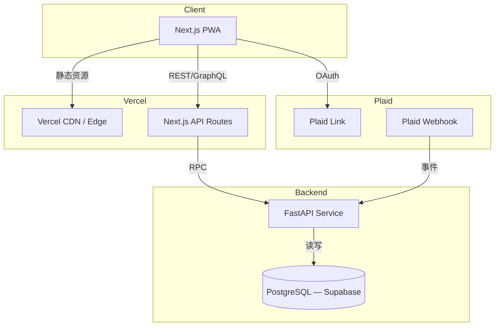

# PFT — Personal Finance Tracker  
**设计文档 Design Document (v0.2, 2025-07-29)**  

> 中英双语；中文在前，英文斜体跟在其后。若两处内容完全一致，仅保留中文。  
> *Bilingual: Chinese first, English in italics right after. When both languages are identical (e.g. code), only Chinese is shown.*

---

## 0 | 一分钟速览  One-Minute Overview
1. **纯前后端分离**：Next.js + FastAPI，Plaid 聚合拉取交易。  
   *Next.js FE, FastAPI BE, Plaid for aggregation.*
2. **PostgreSQL 双表模型**：`raw_transactions` 保原始，`cleaned_transactions` 存去重分类后数据。  
3. **MVP 功能**：  
   - 月度总开支 & 分类汇总  
   - 重复去除（信用卡消费 vs. 借记卡还款）  
4. **部署**：Vercel + Supabase (Postgres)。CI/CD 使用 GitHub Actions，Secrets 注入环境变量。  

---

## 1 | 技术栈 Tech Stack

| 层 Layer | 技术 Technology | 说明 Notes |
| --- | --- | --- |
| 前端 Front-end | Next.js 14 (App Router), TypeScript, Tailwind CSS, **shadcn/ui**, PWA | |
| 后端 Back-end | FastAPI ＋ Uvicorn | 处理 Plaid Webhook & 自定义 API |
| 数据库 DB | PostgreSQL 16 (Supabase) | 双表 + 物化视图 |
| Dev Container | Node 22 LTS, Python 3.12, Docker Compose (Postgres) | VS Code Remote |
| DevOps | GitHub Actions, Vercel, Supabase CLI | Auto deploy preview |
| 第三方 Third-party | Plaid Sandbox/Production | 交易聚合 |
| 数据可视化 Viz | React Charts (Apache ECharts) | MVP 仅柱/折线 |

---

## 2 | 系统架构 System Architecture



---

## 3 | 数据模型 Data Model

### 3.1 `raw_transactions`
| 字段 Field | 类型 Type | 备注 |
| --- | --- | --- |
| `transaction_id` | TEXT PK | Plaid 全局唯一 |
| `account_id` | TEXT | Plaid account |
| `name` | TEXT | 原始商户/备注 |
| `amount` | NUMERIC(14,2) | 负值支出 |
| `currency` | CHAR(3) | |
| `date_posted` | DATE | |
| `payment_channel` | TEXT | `online / in_store / other` |
| `category` | JSONB | Plaid 分类 |
| `inserted_at` | TIMESTAMP | ETL 时间 |

### 3.2 `cleaned_transactions`
继承 `raw_transactions` 字段，新增：  
| 字段 | 类型 | 说明 |
| --- | --- | --- |
| `tag` | ENUM(`expense`,`transfer_out`,`income`,`other`) |
| `norm_category` | TEXT | 二级归一化分类（吃喝、房租…） |
| `statement_month` | DATE | `date_trunc('month', date_posted)` |

> 创建 **物化视图** `monthly_summary_mv`：按 `statement_month, norm_category` 汇总总额，加速前端查询。

---

## 4 | 去重 & 分类算法 Deduplication Algorithm (v0.1)

### 4.1 规则概述 Rules
1. **信用卡消费**：全部标为 `expense`。  
2. **借记卡还款**：若满足下列任一，标为 `transfer_out`：  
   - *名称命中关键词*：`PAYMENT_PATTERNS` 正则。  
   - *与信用卡 payment 相同金额 & 日期±3 天*。  
3. **其它账户**（Venmo、Cash、投资出入金…）暂按交易类型映射。  

### 4.2 关键代码片段 Key Snippet
```python
PAYMENT_PATTERNS = [
    r".*CREDIT CARD.*PAY(MENT)?",
    r".*CR[ED]* CRD PYMT.*",
    r".*AUTOPAY.*",
]

def classify(tx, cc_payments_index):
    up = tx['name'].upper()
    if any(re.match(p, up) for p in PAYMENT_PATTERNS):
        return 'transfer_out'
    if match_cc_payment(tx, cc_payments_index):
        return 'transfer_out'
    return 'expense'

def match_cc_payment(tx, idx):
    key = (round(abs(tx['amount']), 2), tx['date_posted'])
    # idx = {(amount,date): set(transaction_id)}
    for shift in (-3,-2,-1,0,1,2,3):
        k = (key[0], tx['date_posted'] + timedelta(days=shift))
        if k in idx:
            return True
    return False
```

### 4.3 单元测试 Fixtures
- `tests/fixtures/debit_cc_payment.json`  
- `tests/fixtures/cc_spend.json`  

使用 `pytest-parametrize` 跑通 100 % 覆盖率。

### 4.4 未来迭代 Future Work
| 版本 | 功能 | 价值 |
| --- | --- | --- |
| v0.2 | 机器学习自动识别 `transfer_out` | 减少硬编码 |
| v0.3 | 分期还款 / 多笔拆单匹配 | 高精准 |
| v0.4 | 投资账户现金流分类 | 完整资产负债表 |

---

## 5 | API 设计 API Design

| Method | Path | 描述 Description | Auth |
| --- | --- | --- | --- |
| `POST` | `/api/ingest/plaid` | Plaid Webhook 入口 | `X-Plaid-Signature` |
| `GET` | `/api/tx/monthly` | 返回月度总支出 & 分类 | JWT |
| `GET` | `/api/tx/detail` | 分页交易明细 (filters) | JWT |

---

## 6 | MVP 里程碑 Milestones
| Day | 目标 Goal |
| --- | --- |
| **Day 0-1** | 初始化 repo、Dev Container、本地 Postgres |
| **Day 2-3** | Plaid Sandbox Link 流程通 | 
| **Day 4-7** | Ingest → `raw_transactions` ETL |
| **Day 8-10** | 去重/分类模块 & 单元测试 |
| **Day 11-14** | 前端仪表板：月总支出 & 分类图 |
| **Day 15** | 部署到 Vercel Preview |

---

## 7 | 部署 Deployment

```bash
# 1. Supabase 初始化
supabase init
supabase db push

# 2. GitHub Secrets
PLAID_CLIENT_ID=
PLAID_SECRET=
SUPABASE_URL=
SUPABASE_SERVICE_ROLE_KEY=

# 3. Vercel
vercel link
vercel --prod
```

---

## 8 | 本地开发指南 Local Dev Guide

```bash
git clone git@github.com:randy-li/pft.git
cd pft
# VS Code 会自动检测 .devcontainer
```

- **调试前端**：`npm run dev` → http://localhost:3000  
- **调试后端**：`uvicorn app.main:app --reload --port 8000`  
- **刷新历史 3 年数据**：`python scripts/backfill.py --from 2022-06-01`
